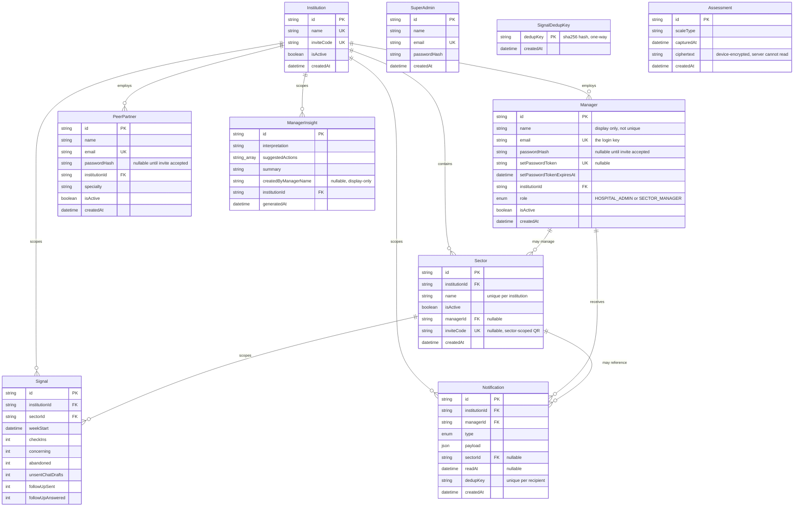
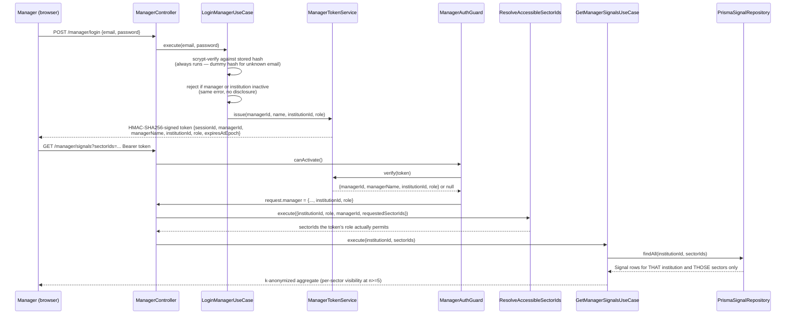
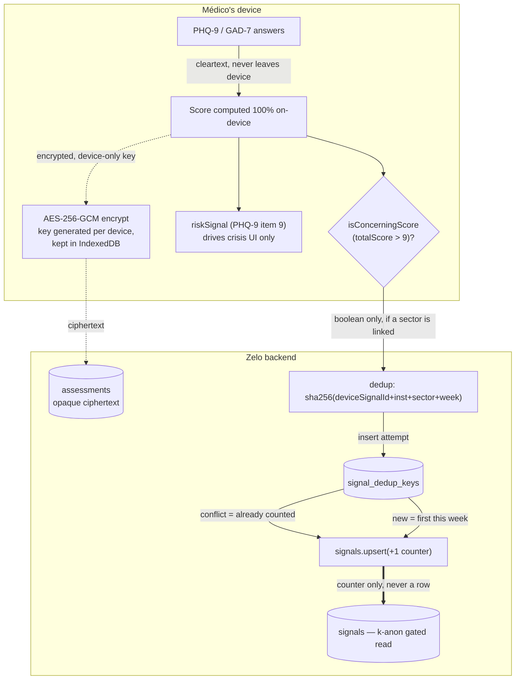

# Architecture Reference

🇺🇸 English · [🇧🇷 Português](architecture-reference.pt-BR.md)

**Last synced:** 2026-09-16, against `origin/develop` at `6beb3fa` — *Merge pull request #40 from
Develophys/feat/forms-react-hook-form-migration*.

A working doctor-facing wellness PWA and the hospital-facing dashboard behind it, written for
whoever plans the next quarter of this system: what exists today, why it's shaped this way,
where it will bend without breaking, and where it won't yet. This is a snapshot, not a live
view — re-derive from the code rather than trust this document once it has moved further.

**Stack:** NestJS 10 + Prisma 7 + Postgres (backend) · React 19 + Vite 6 + TanStack Query
(frontend) · pnpm + Turborepo monorepo · Fly.io (api) + Vercel (web) + Prisma Postgres (db).

> **On the README's tech-stack table.** `README.md`'s "Infra" row still says "GitHub Pages (Web),
> Neon Postgres" — that is stale and contradicts the README's own Deployment section. GitHub
> Pages was retired (commit `ad28d12`); Vercel is the only live frontend, and both remote
> databases are Prisma Postgres. §9 here matches the Deployment section, not the table.

**This document vs. the playbooks.** `docs/conventions/*.md` are *task playbooks* ("you're doing
X, here's the checklist"). This file is the *narrative reference* ("what exists, why, and how it
fits together"). Where a full rule set already lives in a playbook, this document links rather
than restates it.

---

## Table of contents

**Foundations**
1. [System overview](#1-system-overview)
2. [Architecture principles](#2-architecture-principles)
3. [Data model](#3-data-model)

**The system**
4. [Backend modules](#4-backend-modules)
5. [Frontend architecture](#5-frontend-architecture)
6. [Privacy & anonymity architecture](#6-privacy--anonymity-architecture)
7. [Multi-institution model](#7-multi-institution-model)
8. [Security model](#8-security-model)
9. [Deployment & CI/CD](#9-deployment--cicd)

**Planning ahead**
10. [Implementing a new feature](#10-implementing-a-new-feature)
11. [Scaling](#11-scaling)
12. [Trade-offs & technical debt](#12-trade-offs--technical-debt)
13. [Open design questions](#13-open-design-questions)

---

## 1. System overview

Zelo is a mobile-first PWA that gives doctors (*médicos*) a validated self-assessment (PHQ-9,
GAD-7 — MBI-HSS is in the wire enum but has no scoring: `score-assessment.usecase.ts` throws for
it, because the item text is licensed from Mind Garden and unprocured), an AI-assisted support
chat, anonymous peer chat with a volunteer colleague, and an always-available crisis line.
Hospitals and cooperatives that fund the tool get a manager dashboard showing **anonymized,
aggregate** burnout trends across their own staff — never an individual's identity, never even a
hint of one.

That last sentence is the whole architecture in one line. Every non-obvious design choice in
this codebase — the encryption, the k-anonymity threshold, the fact that doctors never have
accounts, the dedup hashing scheme in §6 — exists to make that sentence true under adversarial
scrutiny, not just true in the happy path. Read the rest of this document as elaboration on that
constraint, not a list of unrelated decisions.

### Four personas, two trust models

**Médicos — no login, ever.** The only gate is a local consent flag. No account, no password, no
server-side session, nothing that could later tie a person to their check-ins. This is a product
promise, not a missing feature — see §6.

Everyone else gets a real, server-enforced login — named accounts, scrypt-hashed passwords,
HMAC-signed session tokens. Three separate account types, three separate token secrets, three
separate guards (§8):

| Account | Signs in at | Scope |
|---|---|---|
| **Manager** (`HOSPITAL_ADMIN` / `SECTOR_MANAGER`) | `/manager/login` | One institution; a sector manager is further scoped to the sectors assigned to them. |
| **Peer partner** | `/peer/login` | One institution; answers anonymous peer-chat requests over the WebSocket gateway. |
| **Platform super-admin** | `/admin/login` | The whole platform — creates and (de)activates institutions. Seed-roster only, no signup. |

### Repository shape

| Path | What lives there |
|---|---|
| `apps/api` | NestJS backend — Clean Architecture per module (§2, §4). |
| `apps/web` | React 19 + Vite PWA — ports/use-cases/adapters on the frontend too (§5). Also packages as an Android APK via Capacitor (`apps/web/android/`, `docs/android-apk.md`). |
| `packages/domain` | Zod schemas + entities shared by both apps (`Assessment`, `ChatMessage`, `ConsentRecord`, `CrisisSession`, `RiskSignal`, plus the manager metric bands/glossary). |
| `packages/config` | Shared base configs consumed by both apps: `tsconfig.base.json`, `eslint.base.mjs`, `prettier.base.mjs`, `dependency-cruiser.base.cjs`. |
| `docker/` | `docker-compose.yml` (postgres + api + web), `api.Dockerfile` (the image Fly.io builds), `web.Dockerfile` + `nginx.conf` (local production-like web serving only — not a deploy path). |
| `docs/conventions/` | Task playbooks + `priorities.md`, the ranked backlog. Start here for "how do I do X." |
| `docs/superpowers/` | Every design spec and implementation plan this system was actually built from — the primary source for "why," this document is the "what." |
| `CLAUDE.md` | Always-loaded laws for humans and agents working in the repo. |

---

## 2. Architecture principles

### Clean Architecture, on both sides of the wire

Every backend module and every non-trivial frontend feature follows the same three-layer shape:

| Layer | Backend example | Frontend example |
|---|---|---|
| **Port** — an interface + a DI token, nothing else | `signal-checkin-repository.port.ts` | `signal-checkin.port.ts` |
| **Use-case** — the actual logic, tested against a fake port | `record-signal-checkin.use-case.ts` | `record-signal-checkin.usecase.ts` |
| **Infrastructure** — the concrete adapter (Prisma, fetch, Web Crypto, socket.io) | `prisma-signal-checkin.repository.ts` | `http-signal-checkin.adapter.ts` |

The payoff shows up every time this system gets extended: a use-case's test never touches
Postgres or the network — it's constructed with a small in-memory fake implementing the port, so
the whole suite runs in seconds and never depends on infrastructure being up. When you need a
second implementation of anything (a mock AI provider for local dev, a mock email sender), it's a
new class implementing an existing port, not a rewrite. The layering is machine-enforced:
`dependency-cruiser` configs in `apps/api/`, `apps/web/` and `packages/domain/` (all three
extending `packages/config/dependency-cruiser.base.cjs`) run as `lint:boundaries` in both CI
workflows.

**Naming, exactly:**

- Backend: kebab-case, role suffix on the filename — `*.port.ts`, `*.use-case.ts`,
  `*.repository.ts`, `*.controller.ts`, `*.service.ts`, `*.guard.ts`, `*.gateway.ts`. DI tokens
  are `Symbol("SCREAMING_SNAKE_NAME")` exported at the bottom of the port file.
- Import extensions are **not** uniform, and getting this wrong breaks the built ESM bundle at
  boot: every *relative* specifier ends in `.ts`, every `@/`-aliased specifier ends in `.js`
  (tsc rewrites the former at emit, `tsc-alias` path-maps the latter without touching its
  extension). Full rule and rationale:
  [`docs/conventions/backend-modules.md`](../docs/conventions/backend-modules.md).
- Frontend: same idea, slightly different suffixes — `*.usecase.ts` (no hyphen before "case"),
  `*.port.ts`, `http-*.adapter.ts`, `*.store.ts` for Zustand stores. No import extensions
  (bundler-resolved), `@/` aliased to `apps/web/src`.
- No framework-level DI on the frontend — `apps/web/src/app/container/` is plain
  `new X(new Y())` constructor wiring, split into 11 feature files plus a re-exporting
  `index.ts` (`admin-auth`, `admin-institution`, `assessment`, `chat`, `institution-link`,
  `manager-admin`, `manager-auth`, `manager-dashboard`, `manager-notifications`,
  `peer-partner-auth`, `signal-checkin`). Import from `@/app/container`; there is no
  `container.ts` any more.

Full recipes: [`backend-modules.md`](../docs/conventions/backend-modules.md),
[`backend-http.md`](../docs/conventions/backend-http.md),
[`frontend-architecture.md`](../docs/conventions/frontend-architecture.md).

### Two flavors of frontend state, chosen deliberately

**Zustand + `persist`** — device-local flags that must survive a reload: consent, follow-up
answer, institution link, theme, hotkeys, manager prefs, and the three session stores. Read
outside React via `.getState()` in route loaders and orchestration hooks — never re-derived from
a network call. The storage backend is per-store and deliberate: `localStorage` for the médico's
own device state (`zelo.institution-link`), `sessionStorage` for every session token (§8).

**TanStack Query** — anything that touches the network: logins, submissions, the manager
dashboard's reads, the notification bell. A thin `useMutation`/`useQuery` hook wraps exactly one
use-case call — hooks stay dumb, use-cases stay testable.

**The pattern worth copying:** a pure use-case never reaches into a store itself (see
`ShouldShowFollowUpPromptUseCase`, which takes plain data, not a store reference). The *calling
hook or component* reads the store and passes plain values in. This is what keeps every use-case
unit-testable without mocking Zustand.

---

## 3. Data model

Ten models and two enums in `apps/api/prisma/schema.prisma`. Two of them (`Assessment`,
`SignalDedupKey`) are deliberately built to be useless to an attacker even with full database
access.

| Table | What it's for | What it deliberately does *not* have |
|---|---|---|
| `institutions` | The tenant boundary. One row per hospital/cooperative; `isActive` gates every login into it. | No org chart beyond `sectors`, no self-service signup — created only by a super-admin. |
| `sectors` | The named unit a médico links to and a dashboard segments by. Unique `(institutionId, name)`. | No hierarchy, no headcount. A nullable `managerId` assigns it to one `SECTOR_MANAGER`. |
| `managers` | Named login accounts, one institution each; `role` decides the blast radius. | `passwordHash` is nullable on purpose — a newly invited manager has none until they use their set-password link. |
| `peer_partners` | Volunteer colleagues who answer anonymous peer-chat requests. | Never linked to a `Signal`, a transcript, or a médico — the match lives in memory only (§6). |
| `super_admins` | The platform account that creates institutions. | No institution FK, no role field, no signup path. |
| `manager_insights` | Saved AI-generated analyses of the aggregate trend. | `createdByManagerName` is a denormalized display string, not a foreign key. |
| `signals` | The real aggregate: per institution/sector/week counters — `checkIns`, `concerning`, `abandoned`, `unsentChatDrafts`, `followUpSent`, `followUpAnswered`. | **No per-person row, ever.** This table only ever holds counters — see §6. |
| `signal_dedup_keys` | Prevents one device inflating its own sector's counters within a week — one hash per counter, per device, per week. | No reference back to a device, institution, sector, or person — just a one-way hash (§6). |
| `notifications` | Manager-facing events (invite accepted/expired/failed, account deactivated/reactivated, sector became visible, sector risk threshold). | No médico-facing notifications at all. `dedupKey` is unique *per recipient*, because one event fans out to one row per manager. |
| `assessments` | A médico's own encrypted history. | No `userId`. No plaintext score. No link to `signals` whatsoever. |

`SimulatedFollowUp` is gone. The `add_followup_counters_drop_simulated` migration dropped it and
moved follow-up counts onto `Signal`, where they are institution- *and* sector-scoped like every
other counter — which quietly retired the root cause of `TD-003` (§12).

Generator note: `schema.prisma` uses the `prisma-client` generator (not the classic client),
output to `apps/api/generated/prisma`. `PrismaService`'s constructor picks a driver adapter by
connection string: `PrismaNeon` over a WebSocket when `DATABASE_URL` contains `.neon.tech`,
`PrismaPg` otherwise. Both configured remote databases are Prisma Postgres (`db.prisma.io`), so
the Neon branch is almost certainly unexercised today — see §9.

---

## 4. Backend modules

`apps/api/src/modules/` — eleven NestJS modules, each self-contained, wired together only in
`app.module.ts`. Across them: 42 HTTP routes and one WebSocket gateway.

| Module | Owns | Auth |
|---|---|---|
| `health` | `GET /health` — Fly.io's liveness check target. | None |
| `chat` | `POST /chat/stream` — an NDJSON token stream from the AI acolhimento chat; swappable provider (`groq` vs. `mock`) via `AI_PROVIDER`. Includes the tone guard (`application/tone/`). | None |
| `assessment` | `POST /assessments` — stores the encrypted ciphertext blob. Validated by `@zelo/domain`'s `AssessmentSchema`, whose object shape has no `answers` and no `riskSignal` field at all, so Zod strips both — architecturally enforced, not just convention. | None |
| `institution` | `GET /institutions/by-code/:code` (resolves *either* an institution invite code or a sector-scoped one) and `GET /institutions/:id/sectors`. Never echoes an invite code back. | None |
| `sector` | No controller — a shared repository plus `GetSectorByInviteCodeUseCase`, consumed by `institution` and `manager`. | n/a |
| `signal-checkin` | Four anonymous aggregate writes: `POST /signals/checkin`, `/abandon`, `/chat-draft`, `/follow-up` (§6). | None |
| `manager` | Login by email, finish-setup, forgot-password, accessible sectors, the signals read, AI insight generation and insight history — plus the whole `manager/admin` surface (sectors, managers, peer partners: list/create/update/delete/resend-invite). | `ManagerAuthGuard`; the 14 `manager/admin` routes additionally require `HospitalAdminGuard` |
| `notification` | `GET /manager/notifications`, `/unread-count`, `PATCH /:id/read`, `POST /read-all`, plus three scheduled sweeps (`@Cron`, UTC: daily 03:00 for lapsed invites and retention, Mondays 03:00 for sector risk). | `ManagerAuthGuard` |
| `peer-partner` | `POST /peer-partner/login`, `/finish-setup`, `/forgot-password`. Its `PeerPartnerAuthGuard` is exported but guards no HTTP route — the peer partner's authenticated surface is the WebSocket gateway, which verifies the token itself. | None on HTTP |
| `peer-chat` | The socket.io gateway (`request-peer`, `accept_request`, `decline_request`, `message`, `leave_conversation`) plus in-memory presence and match registries. | Token verified in `handleConnection` |
| `admin` | `POST /admin/login`, then create/list/update institutions and read an institution's sectors. | `AdminAuthGuard`, every route but login |

### The manager module's auth chain, traced end to end

This is the one flow worth tracing exactly, because it's the seam where a real security bug
would land — and where every later plan (institution scoping, the signal pipeline, sector
permissions) had to slot in without weakening it.

`institutionId` and `role` are never read from a request body, a query param, or anywhere
client-controlled — they only ever come out of a signature-verified token. A client *may* send
`?sectorIds=`, but it is a narrowing filter intersected against what the token's role permits,
never a widening one. Every manager-scoped repository call takes `institutionId` as an explicit
parameter and filters server-side. There is no code path where a manager can see another
institution's rows — or a sector manager another sector's — short of forging an HMAC signature.

---

## 5. Frontend architecture

`apps/web/src/` — the same layered discipline as the backend, plus the presentation layer React
actually needs.

| Folder | Contents |
|---|---|
| `domain/` | Pure functions with zero framework dependency — `isConcerningScore` / `CONCERNING_SCORE_THRESHOLD`, the PHQ-9 and GAD-7 scale definitions, and the on-device `AssessmentRecord` shape (the one that *does* carry `riskSignal`). |
| `ports/` | Interfaces, zod response schemas and typed error classes (e.g. `InstitutionNotFoundError`), one file per external boundary — 16 of them. |
| `use-cases/` | 47 orchestration classes, constructor-injected with ports, unit-tested against fakes. |
| `infrastructure/` | Concrete adapters grouped by transport: `http/` (`http-*.adapter.ts` plus `api-base-url.ts`), `crypto/web-crypto-encryption.adapter.ts`, `storage/indexeddb-assessment-store.adapter.ts`, `websocket/peer-chat-socket.client.ts`. |
| `stores/` | Zustand stores — see §2. |
| `presentation/` | `pages/`, `hooks/` (thin TanStack Query wrappers), `layout/` (`PhoneShell`, `Sidebar`, `BottomNav`, `ManagerShell`, `ManagerSidebar`, `AppHeader`, hotkey listeners), `components/` (composed feature pieces), `ui/` (primitives: `Card`, `Button`, `Modal`, `DataTable`, `TextField`, ...), `lib/` (`routes.ts`, `band-for.ts`, `crisis-line.ts`). |
| `app/` | `router.tsx` (route table and loaders), `container/` (DI wiring, §2), `query-client.ts`, `index.css`. |
| `dev/` | Dev-only helpers (`seed-assessment-history.ts`), not shipped behavior. |

Forms use react-hook-form + zod, not per-field `useState` — the rule set and reference
implementation live in [`CLAUDE.md`](../CLAUDE.md) and
[`forms-and-ui.md`](../docs/conventions/forms-and-ui.md).

### Routing and guards

`react-router` **v8**'s data router (`createBrowserRouter`). One exported `routeChildren` array
in `router.tsx` that both the app and `router.test.tsx` import directly — the test suite can
never silently drift from what actually ships. It is no longer flat: the whole manager panel
sits under a single `ManagerShell` layout route, so the shell and its session guard are declared
once instead of per screen. Four guard patterns, matching the trust models from §1:

- **Consent-gated** (`/home`, `/chat`, `/assessment/*`, `/peers`, `/you`, `/you/link`,
  `/settings`): the loader redirects to `/privacy` if
  `!useConsentStore.getState().hasConsented`.
- **Deliberately ungated:** `/crisis`, `/crisis/connect`, `/crisis/line`. Someone reaching for
  the crisis line must not be sent through a consent form first, and those screens collect
  nothing.
- **Session-gated**, one per account type: `useManagerSessionStore` (the `ManagerShell`
  subtree), `useAdminSessionStore` (`/admin`), `usePeerPartnerSessionStore` (`/peer`,
  `/peer/settings`).
- **Role-gated:** the three `/manager/admin/*` screens additionally redirect unless
  `role === "HOSPITAL_ADMIN"`. All three are built from one `ADMIN_ONLY_ROUTES` list so the
  extra guard cannot drift between them.

Every one of these is a UX convenience only; the real boundary is the server-side guard (§4, §8).

### Two shells, not one

The médico- and peer-partner-facing screens render inside `PhoneShell`; the whole manager panel
renders inside `ManagerShell` instead (its own sidebar, header, bottom nav and a
`useManagerSessionExpiry` effect declared once for every manager page rather than copied onto
some of them). Both are single trees across every viewport — only breakpoints change, so a
resize never unmounts a table and refetches its in-flight queries.

`PhoneShell` has outgrown the two-boolean API it launched with. It now takes `sidebar`
(persistent `Sidebar` at ≥768px), `bottomNav` (`true` for the shared
médico nav, or a node for a persona with its own — the peer-partner nav is two items, the
médico's five), `centered` (a ~680px reading column at ≥768px), `fill` (exact viewport height
for surfaces that own an internal scroll region, i.e. chat), `bleed`, `bg`, `chrome`
(`'doctor'` shows the anonymity badge, `'manager'` drops it) and header overrides. The header's
back button is derived, not passed: it appears exactly at the widths where the shell renders no
nav at all, so a screen with neither sidebar nor bottom nav is never a dead end.

---

## 6. Privacy & anonymity architecture

The product's central trust claim — "ninguém do hospital vê quem você é" — traced down to which
bytes cross which boundary, in what form. The enforcement checklists for changes in this area
are [`security-privacy.md`](../docs/conventions/security-privacy.md) and
[`product-invariants.md`](../docs/conventions/product-invariants.md).

### Two intentionally separate signals — never conflate them

| | `riskSignal` | `isConcerningScore` |
|---|---|---|
| Source | PHQ-9 item 9 only (self-harm ideation) | `totalScore > 9`, either scale |
| Purpose | Offer the crisis-escalation flow, locally | Feed the anonymous aggregate signal |
| Ever transmitted? | Not from the assessment path — `AssessmentSchema` has no such field, so Zod strips it. The chat wire contract *does* carry a `hasActiveRiskSignal` boolean (it selects the crisis fallback when the AI provider dies mid-conversation), but `ChatPage` hardcodes it to `false` today: real risk-signal detection in chat is unbuilt. | Yes, as a bare boolean, only if a device is linked to a sector |
| Scale coverage | PHQ-9 only | PHQ-9 and GAD-7 (their "Leve" band ceiling is 9 on both) |

Chat text gets a second, independent treatment: `anonymize-text.usecase.ts` scrubs the message
on-device before `POST /chat/stream` ever sees it, and that endpoint's schema accepts only
`AnonymizedMessage`s.

### What "no per-person row, ever" actually means

The four check-in endpoints (§4, §7) do not write a row and then aggregate it later — there is
no intermediate table a breach or an insider could read to reconstruct who submitted what. The
only two writes, inside one transaction, are:

1. An attempted insert of a one-way hash into `signal_dedup_keys` — the row, if it lands, is
   indistinguishable from any other hash; nothing about it says which institution, sector, or
   device produced it.
2. An `UPSERT` on `signals`'s counters — the only artifact that persists is "N check-ins, M
   concerning, this institution, this sector, this week."

Because the dedup hash includes `weekStart`, the same device's hash changes every week —
`signal_dedup_keys` cannot be used to build a longitudinal profile of one device even if every
row in it were exposed.

**k-anonymity is enforced at read time, server-side, always.** `K_ANONYMITY_THRESHOLD = 5`
(`manager/application/constants.ts`). `GetManagerSignalsUseCase` decides visibility per sector at
one shared *reference week* — the newest week in which at least one sector actually reaches k,
not simply the newest week, because a Monday-morning partial week would otherwise suppress every
sector at once and blank the dashboard. A sector below the threshold at that week is dropped
*before* serialization, and every downstream aggregate (the 4-week volumes, the trend, the
follow-up rate) reads only from the visible set — so a suppressed sector's numbers cannot leak
through an institution-wide sum. `sectorCoverage.total` counts the sectors the query was scoped
to rather than the sectors with rows, so "0 of 4" never reveals whether a suppressed sector has
any activity at all.

Peer chat is the one real-time surface, and it is deliberately stateless: the pairing lives in
in-memory registries in `peer-chat/application/services/`, and no transcript, match record, or
participant pair is ever persisted.

---

## 7. Multi-institution model

How "which hospital do these anonymous numbers belong to" gets answered without ever creating an
identity.

### The linking flow, end to end

1. A hospital distributes an invite code out of band (HR onboarding, an internal memo, a printed
   QR code). Codes come in two kinds: an **institution** code (`Institution.inviteCode`) and an
   optional **sector-scoped** code (`Sector.inviteCode`, typically behind a QR poster in that
   sector).
2. The médico opens **Você → Vincular a um hospital** (or a Home banner shown only while
   unlinked) and types or scans it.
3. `GET /institutions/by-code/:code` resolves it — no authentication, just a code-to-id lookup.
   It tries the institution codes first, then the sector codes.
4. If the code was sector-scoped, the flow skips straight to a confirmation step naming that
   sector. Otherwise the médico picks their sector from that institution's registered active
   sectors (`GET /institutions/:id/sectors`).
5. The device generates a random `deviceSignalId` and persists
   `{ institutionId, institutionName, sectorId, sectorName, deviceSignalId }` to `localStorage`
   — never sent anywhere as an identity, only used locally to build the dedup hash in §6.

**Departments are no longer free text.** Sectors are first-class rows created by a hospital
admin, unique per `(institutionId, name)`, and `Signal.sectorId` is a foreign key. That removed
the typo-fragmentation problem the free-text era had, at the cost of an onboarding step: a
sector must exist before anyone can link to it.

**This is still a soft trust boundary, deliberately.** The invite code proves "entered through
the right door," not employment. There is no verification that the person linking actually works
at that institution.

### What "optional" is load-bearing for

A médico who never links anything loses *nothing* except being counted in any hospital's
aggregate — self-assessment, chat and the crisis line are identical either way. (Anonymous peer
chat is the one exception: it matches within an institution, so it needs a link.) This isn't a
convenience; it's the same anonymity promise from §1 extended to a médico who, for whatever
reason, doesn't want their hospital to know they use the app at all.

### Where the tenant boundary is actually enforced

| Layer | Enforcement |
|---|---|
| Schema | `Manager.institutionId`, `PeerPartner.institutionId`, `Sector.institutionId`, `Signal.institutionId`, `ManagerInsight.institutionId` and `Notification.institutionId` are all required FKs, not nullable. |
| Session token | HMAC-signed, carries `institutionId` **and** `role` — neither can be forged or edited client-side. |
| Login | Rejects if the manager is inactive *or* their institution is inactive, behind the same non-disclosing error as a wrong password. |
| Every manager-scoped query | Takes `institutionId` as an explicit parameter; a `SECTOR_MANAGER` additionally has `sectorIds` resolved server-side from their assignments. |
| k-anonymity grouping key | `institutionId + sectorId`, not a name — two institutions that both have a "UTI" can't pool it to fake reaching n=5 for either. |

---

## 8. Security model

What's authenticated, what deliberately isn't, and why each choice is defensible rather than
accidental. Checklist form: [`security-privacy.md`](../docs/conventions/security-privacy.md).

### Account authentication

- **Passwords:** `node:crypto`'s `scrypt` plus a salt, compared with `timingSafeEqual` — no
  bcrypt/argon2 dependency, matching the "no new crypto library" convention. Same service shape
  for all three account types.
- **Disclosure symmetry:** unknown email, pending invite (`passwordHash` still null), wrong
  password, deactivated account and deactivated institution all throw the identical
  `InvalidManagerCredentialsError` → 401, and the login use-case always runs a real scrypt verify
  (against a dummy hash of the right shape) so response timing can't reveal whether an email has
  an account.
- **Session tokens:** a hand-rolled HMAC-SHA256-signed opaque token (not a JWT library), JSON
  payload, 8-hour expiry, held in `sessionStorage` (not `localStorage` — dies with the tab,
  deliberately). Three independent secrets: `MANAGER_TOKEN_SECRET`, `ADMIN_TOKEN_SECRET`,
  `PEER_PARTNER_TOKEN_SECRET`.
- **Boot-time env validation** (`shared/config/env.validation.ts`) refuses to start a production
  process with any token secret under 32 characters, with `EMAIL_PROVIDER=mock`, or with the
  localhost `WEB_APP_BASE_URL` default — the three misconfigurations that would otherwise fail
  silently and late.

**TD-001 — sessionStorage + Bearer, not an HttpOnly cookie.** Accepted, not fixed: the frontend
(Vercel) and API (Fly.io) are cross-origin, so an HttpOnly cookie would need `SameSite=None`,
which removes the CSRF protection cookies are meant to provide unless a CSRF token is added too,
and it turns the synchronous router guard into an async round-trip per manager navigation — a
~3–5 hour migration across roughly 17 files, not a quick swap. Compensating control: no
`dangerouslySetInnerHTML` anywhere on a manager route. A migration design exists but is unmerged
(`2026-09-14-httponly-cookie-session-migration-design.md`).

### Deliberately unauthenticated endpoints

16 of the 42 HTTP routes require no auth: `GET /health`; `POST /assessments`;
`POST /chat/stream`; `GET /institutions/by-code/:code` and `GET /institutions/:id/sectors`; the
four `POST /signals/*` writes; and, for each of the three account types, its `login`,
`finish-setup` and `forgot-password` routes (`/admin` has only `login`). For the assessment and
chat endpoints this is the entire point — a médico never proves identity to this app. For the
institution and check-in endpoints it follows from §7: linking isn't a login, so nothing to
authenticate exists yet at that point in the flow. `finish-setup` authenticates with a
single-use hashed set-password token instead of a session; `forgot-password` follows the same
non-disclosure rule as login — unknown or deactivated emails get a silent no-op and an identical
200 either way.

**Known gap — no per-endpoint rate limit except on the two forgot-password routes.** A global
`ThrottlerModule` (100 requests/60s per IP, via `APP_GUARD` in `app.module.ts`) protects
everything else uniformly. The institution-by-code lookup and the four check-in endpoints have no
*tighter* limit of their own, even though a real device checks in at most once a week. A
low-entropy, guessable invite code (seeded ones look like `zelo-demo-2026`) plus a rotating
`deviceSignalId` could inflate a sector's counters well past what the throttle catches. Flagged,
not yet fixed — see §12. The forgot-password routes are the exception: as the first
unauthenticated routes accepting a bare email — a spam and enumeration target — each carries its
own `@Throttle` override (5 requests per 15 minutes per IP).

### Transport & infrastructure

- `force_https = true` in both `fly.toml` and `fly.dev.toml` — nothing reaches either API over
  plaintext HTTP.
- CORS is an explicit allowlist read from `CORS_ALLOWED_ORIGINS` (the defaults cover only local
  dev), and the socket.io gateway reads the same variable. The frontend and API are never
  same-origin.
- Prisma's driver adapter is chosen per-environment in `PrismaService`'s constructor (§3, §9).
- Zod validates every request body at the controller boundary; NestJS's `BadRequestException` is
  the uniform 400 response shape. Mapping rules:
  [`backend-http.md`](../docs/conventions/backend-http.md).

---

## 9. Deployment & CI/CD

Two apps, two pipelines, two hosts — and, since the dev/prod split, two fully independent
environments. The operational detail and the known traps live in
[`monorepo-tooling.md`](../docs/conventions/monorepo-tooling.md) §6; this is the shape.

| | `apps/api` | `apps/web` |
|---|---|---|
| Host | Fly.io, region `gru` (São Paulo) | Vercel |
| Prod | app `zelo-api` (`fly.toml`), deployed from `main` | `zelohealth.app` |
| Dev | app `zelo-api-dev` (`fly.dev.toml`), deployed from `develop` | `dev.zelohealth.app` |
| Build | `docker/api.Dockerfile` | Vite, base `/` (`apps/web/vercel.json` drives the Vercel build) |
| CI workflow | `.github/workflows/api.yml` (test → `deploy` / `deploy-dev`) | `.github/workflows/web.yml` (lint, test, build only) |
| Deploy trigger | flyctl, from the workflow | Vercel's own git integration — **not** GitHub Actions |
| Database | Prisma Postgres, one instance per environment | *(same)* |

`web.yml` has no deploy job at all, and must not get one. The API has exactly one deploy path
(`api.yml`'s flyctl jobs); the web app has exactly one (Vercel's git integration).

**Migrations: manual for prod, automatic for dev.** `deploy-dev` runs `prisma migrate deploy`
against the dev database before deploying. The `main` `deploy` job does not — a production schema
change must be applied by hand (`DIRECT_DATABASE_URL` pointing at prod, from
`apps/api/.env.production.local`) *before* the deploy lands, or the new code boots against a
schema that lacks its tables. Seeding is always manual, in both environments. See
`apps/api/prisma/README.md`.

**The seed script can delete real data.** Re-running the seed deletes and regenerates every
`Signal` row for the two demo institutions (`zelo-demo-2026`, `sao-lucas-2026`). Since real
médicos can link to those same institutions, a re-seed against an environment where a real device
linked destroys their real check-in history — documented as an explicit warning in
`apps/api/prisma/README.md`, not yet prevented in code. Treat any pilot institution as one that
should **not** be a seeded demo institution.

**Two pieces of retired GitHub Pages plumbing are still in the tree**, and should not be read as
evidence Pages is coming back: `apps/web/vite.config.ts` still normalizes a `VITE_BASE_PATH` that
no workflow sets any more (it falls back to `"/"`), and `turbo.json` still declares it in
`build.env`. Removing them is `priorities.md` #13; this document no longer describes that build
path as live.

**One more trap worth knowing before you build an APK:** `apps/web/package.json`'s `build:native`
hardcodes `VITE_API_BASE_URL=https://zelo-api.fly.dev` — production — with no environment branch,
and `android:sync` calls it unconditionally. An APK built from `develop` still writes to the
production database.

---

## 10. Implementing a new feature

The recipes live in the playbooks, which are kept current per PR. This section says which one to
open and what shape the work takes, so it can't drift out of sync with them.

| You're building | Open |
|---|---|
| A new NestJS module or endpoint | [`backend-modules.md`](../docs/conventions/backend-modules.md), plus the `zelo-backend-endpoint` skill |
| Request validation, error-to-HTTP mapping | [`backend-http.md`](../docs/conventions/backend-http.md) |
| A new frontend screen, end to end | [`frontend-architecture.md`](../docs/conventions/frontend-architecture.md), plus the `zelo-frontend-flow` skill |
| A form | [`forms-and-ui.md`](../docs/conventions/forms-and-ui.md) and [`CLAUDE.md`](../CLAUDE.md), plus the `zelo-form` skill |
| An admin list or table screen | the `zelo-admin-table` skill |
| Anything touching the chat stream or the peer gateway | [`realtime-and-streaming.md`](../docs/conventions/realtime-and-streaming.md) |
| Anything touching k-anonymity, crisis flow, tone guard, notifications | [`product-invariants.md`](../docs/conventions/product-invariants.md) |
| Anything touching auth, tenant scoping, or what leaves the device | [`security-privacy.md`](../docs/conventions/security-privacy.md) |
| Tests | [`testing.md`](../docs/conventions/testing.md) |
| CI, Turborepo, Prisma, deploy | [`monorepo-tooling.md`](../docs/conventions/monorepo-tooling.md) |

The invariant shape underneath all of them: **port and DI token first, then a failing use-case
test against a fake port, then the use-case, then the concrete adapter, then the wiring** —
backend in `*.module.ts` and `app.module.ts`, frontend in `app/container/` plus a route entry in
`router.tsx`'s `routeChildren` and a path constant in `presentation/lib/routes.ts`. Schema
changes go through `prisma migrate dev --create-only`; if a table with production rows gains a
required column, hand-edit the migration into nullable → backfill → `NOT NULL` order, because
Prisma won't generate that safely on its own.

**Before writing code:** check `docs/superpowers/specs/`. Nearly every module in this system has
a corresponding design spec (the "why") and implementation plan (the exact "how," task by task).
For any non-trivial feature, the fastest path to matching this codebase's conventions is finding
the most similar already-shipped spec and mirroring its shape. Note that the July-era specs
predate React 19 and Tailwind 4 and describe superseded UI APIs — read them for intent, not for
current syntax (`priorities.md` #13).

---

## 11. Scaling

What holds at today's volume, and the specific place each part would need to change first as
usage grows. None of this is built yet — it's the planning surface this document exists to
support.

### Near-term pressure points

| Component | Today | First thing to change |
|---|---|---|
| API compute | One Fly.io machine per environment, `gru`, `min_machines_running = 1`, `auto_stop_machines = false` | No autoscaling configured — add machine count and concurrency limits before real multi-hospital traffic, not after. |
| Scheduled sweeps | `@Cron` jobs inside the same single API process; correctness currently rests on there being exactly one machine | Running two machines needs either leader election or reliance on the `(managerId, dedupKey)` unique constraint alone. The code notes this; nothing enforces it. |
| `signals` writes | Synchronous upsert per check-in, one row per institution/sector/week | Hot-row contention during shift-change spikes at a large hospital — a write-behind queue batching increments would remove that, but isn't needed at current volume. |
| Manager dashboard reads | `GetManagerSignalsUseCase` re-aggregates from `signals` in application code on every request | No caching layer yet. Fine while the table is small; worth a materialized view or short-TTL cache once check-in volume grows. |
| Peer-chat matching | In-memory presence and match registries in one process | Anything multi-machine needs shared state (Redis, or a sticky-session gateway) before a second machine can exist. |
| Institution onboarding | A real super-admin screen (`/admin`), but still one person creating rows by hand | Becomes an operational bottleneck before it becomes a security problem. Sector self-registration by a hospital admin already exists; institution self-signup deliberately does not. |
| Risk and k-anonymity constants | Global constants (`K_ANONYMITY_THRESHOLD = 5`; `RISK_RATE_THRESHOLD`, `RISK_MIN_CHECK_INS`, `RISK_DELTA_THRESHOLD` and the retention windows in `notification/application/thresholds.ts`) | Per-institution settings are already spec'd (`2026-08-23-institution-settings-design.md`) — the thresholds file is deliberately written as the single point that change would land on. |

### What doesn't need to change soon

- The Clean Architecture layering (§2) scales by adding modules, not by restructuring existing
  ones — every feature shipped so far has been additive at the module level.
- The device-local privacy model (§6) has no server-side scaling cost by construction: there's no
  per-person data to grow.
- Splitting CI by app (§9) already prevents an unrelated backend change from re-running the
  frontend's test suite, and vice versa.

---

## 12. Trade-offs & technical debt

Every entry here was a deliberate, documented decision — not an oversight. The formal record is
`docs/superpowers/specs/technical-debt.md`; the ranked, still-open backlog is
[`docs/conventions/priorities.md`](../docs/conventions/priorities.md). This is the summary an
architect needs without reading either in full.

| ID | Decision | Status |
|---|---|---|
| `TD-001` | Manager session in `sessionStorage` + Bearer header, not an HttpOnly cookie (§8). | Accepted, deferred — a migration design is written but unmerged. |
| `TD-002` | Insight history was shared across all managers at one institution. | Resolved — filtered by `institutionId`. |
| `TD-003` | The follow-up response-rate KPI had no `institutionId` (it read a standalone `SimulatedFollowUp` table). | Overtaken by events: that table was dropped and the counters moved onto `Signal`, so the KPI is now institution- and sector-scoped like every other number. `technical-debt.md` still carries the old entry text. |
| — | No per-endpoint rate limit on the unauthenticated institution-lookup and check-in endpoints (§8). | Parked |
| — | The seed script deletes real check-in data if re-run against a linked institution (§9). | Documented, not yet prevented in code. |
| — | Unlink-then-relink within the same week double-counts (a fresh `deviceSignalId` is minted on each link). | Accepted trade-off — the alternative (persisting the id across unlink) weakens "unlink leaves nothing behind." |
| — | `deviceSignalId` crosses the wire in plaintext on every check-in. | Mitigated by HTTPS-only transport; the at-rest guarantee (§6) holds regardless. |
| — | Dead GitHub Pages plumbing (`VITE_BASE_PATH` in `vite.config.ts` and `turbo.json`), and a README tech-stack table that contradicts the README's own Deployment section (§9). | Open — `priorities.md` #13. |
| — | `build:native` hardcodes the production API URL, so any APK — including one built from `develop` — writes to production (§9). | Open — `priorities.md` #25. |
| — | `router.tsx` statically imports every page, so a médico downloads the whole manager/admin panel to reach `/home`. | Open and known — `priorities.md` #14. Any fix must preserve the `routeChildren` export `router.test.tsx` depends on. |

---

## 13. Open design questions

Real, scoped design work waiting on a product decision — not vague ideas.

- **Doctor-side identity.** `identity-and-aggregation.md`'s full `User` model plus magic-link
  auth was designed and never built. Anonymous peer chat shipped *without* it — `PeersPage` is a
  real, working surface backed by the socket.io gateway, matching within an institution and
  persisting nothing — which is the strongest evidence yet that a doctor account may simply not
  be needed. What still has no answer is anything requiring continuity across sessions or
  devices: a returning match, or a history that survives clearing browser storage.
- **WhatsApp channel.** Fully spec'd (`2026-07-28-whatsapp-channel-design.md`) with an OTP
  device-linking flow designed to mirror this system's device-local, no-login pattern — still not
  in `main` or `develop` as of this sync (`grep -rli whatsapp apps packages` returns nothing).
- **Per-institution settings.** The k-anonymity threshold and all the notification risk and
  retention constants are global. `2026-08-23-institution-settings-design.md` describes making
  them per-institution; `notification/application/thresholds.ts` is deliberately written as the
  single point that change would land on.
- **Self-service institution onboarding.** Explicitly out of scope. The super-admin screen is the
  deliberate middle step; public hospital signup remains a non-goal.
- **MBI-HSS.** Present in the wire enum and named on the assessment picker, unimplemented in
  scoring — blocked on licensing (Mind Garden), not on engineering.
