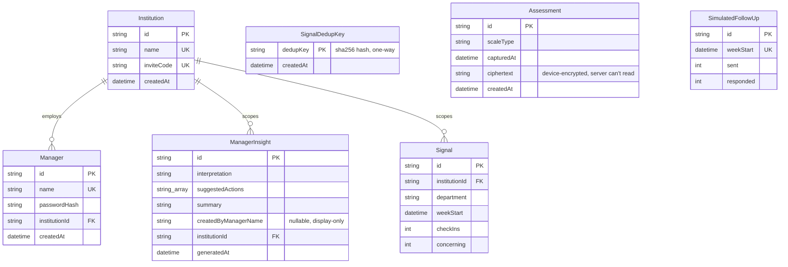
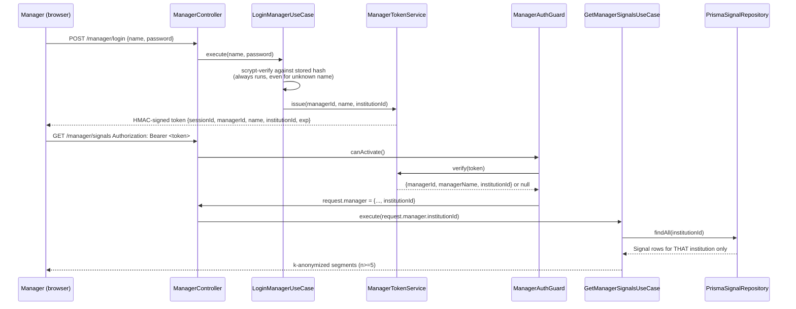
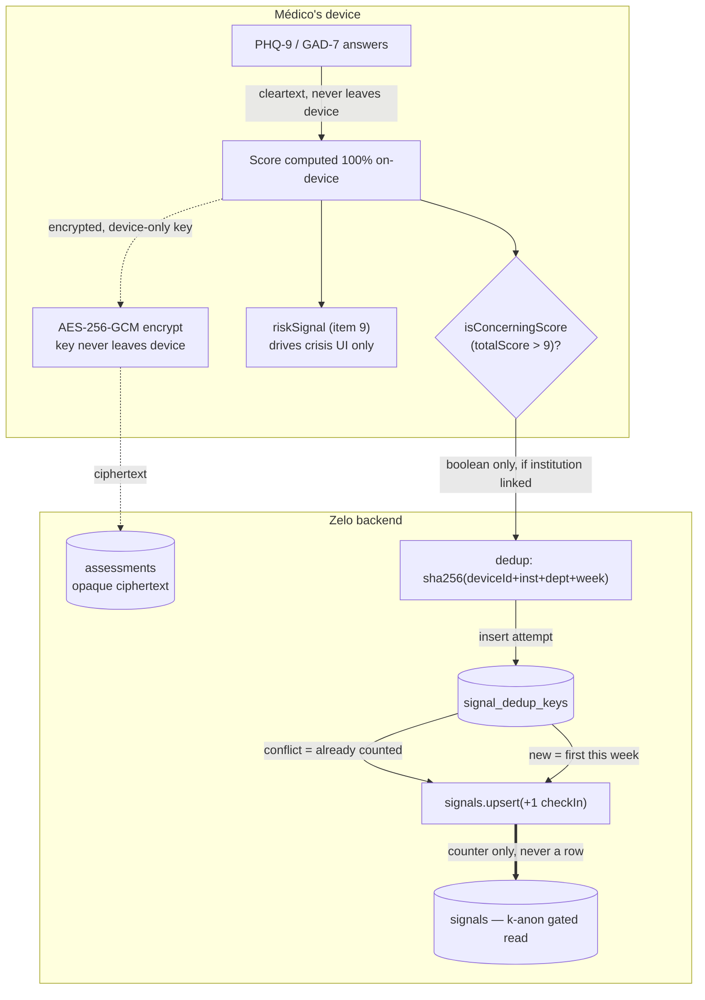

# Architecture Reference

🇺🇸 English · [🇧🇷 Português](architecture-reference.pt-BR.md)

**Last synced:** 2026-08-02, after `2026-08-02-multi-institution-data-partitioning-design.md`'s
two implementation plans merged to `main`.

A working doctor-facing wellness PWA and the hospital-facing dashboard behind it, written for
whoever plans the next quarter of this system: what exists today, why it's shaped this way,
where it will bend without breaking, and where it won't yet. This is a snapshot, not a live
view — re-derive from the code rather than trust this document once it has moved further.

**Stack:** NestJS + Prisma + Postgres (backend) · React + Vite + TanStack Query (frontend) ·
pnpm + Turborepo monorepo · Fly.io (api) + GitHub Pages (web) + Neon (db).

---

## Table of contents

**Foundations**
1. [System overview](#1-system-overview)
2. [Architecture principles](#2-architecture-principles)
3. [Data model](#3-data-model)

**The system**
4. [Backend modules](#4-backend-modules)
5. [Frontend architecture](#5-frontend-architecture)
6. [Privacy & anonymity architecture](#6-privacy--anonymity-architecture)
7. [Multi-institution model](#7-multi-institution-model)
8. [Security model](#8-security-model)
9. [Deployment & CI/CD](#9-deployment--cicd)

**Planning ahead**
10. [Implementing a new feature](#10-implementing-a-new-feature)
11. [Scaling](#11-scaling)
12. [Trade-offs & technical debt](#12-trade-offs--technical-debt)
13. [Open design questions](#13-open-design-questions)

---

## 1. System overview

Zelo is a mobile-first PWA that gives doctors (*médicos*) a validated self-assessment (PHQ-9,
GAD-7 — MBI-HSS is spec'd but unimplemented, item text is licensed and unprocured), an
AI-assisted support chat, and opt-in crisis escalation. Hospitals and cooperatives that fund the
tool get a manager dashboard showing **anonymized, aggregate** burnout trends across their own
staff — never an individual's identity, never even a hint of one.

That last sentence is the whole architecture in one line. Every non-obvious design choice in
this codebase — the encryption, the k-anonymity threshold, the fact that doctors never have
accounts, the dedup hashing scheme in §6 — exists to make that sentence true under adversarial
scrutiny, not just true in the happy path. Read the rest of this document as elaboration on that
constraint, not a list of unrelated decisions.

### Two audiences, two trust models

**Médicos — no login, ever.** The only gate is a local consent flag. No account, no password, no
server-side session, nothing that could later tie a person to their check-ins. This is a product
promise, not a missing feature — see §6.

**Managers — a real, server-enforced login.** Named accounts, scrypt-hashed passwords, signed
session tokens scoped to one institution. Keeping an unauthorized party *out* is the whole point
here — see §7 and §8.

### Repository shape

| Path | What lives there |
|---|---|
| `apps/api` | NestJS backend — Clean Architecture per module (§2, §4). |
| `apps/web` | React + Vite PWA — ports/use-cases/adapters on the frontend too (§5). |
| `packages/domain` | Zod schemas + entities shared by both apps (e.g. `Assessment`, `ChatMessage`). |
| `docker/` | Local Postgres compose file, API Dockerfile for Fly.io. |
| `docs/superpowers/` | Every design spec and implementation plan this system was actually built from — the primary source for "why," this document is the "what." |

---

## 2. Architecture principles

### Clean Architecture, on both sides of the wire

Every backend module and every non-trivial frontend feature follows the same three-layer shape:

| Layer | Backend example | Frontend example |
|---|---|---|
| **Port** — an interface + a DI token, nothing else | `signal-checkin-repository.port.ts` | `signal-checkin.port.ts` |
| **Use-case** — the actual logic, tested against a fake port | `record-signal-checkin.use-case.ts` | `record-signal-checkin.usecase.ts` |
| **Infrastructure** — the concrete adapter (Prisma, fetch, Web Crypto) | `prisma-signal-checkin.repository.ts` | `http-signal-checkin.adapter.ts` |

The payoff shows up every time this system gets extended: a use-case's test never touches
Postgres or the network — it's constructed with a small in-memory fake implementing the port, so
the whole suite runs in seconds and never depends on infrastructure being up. When you need a
second implementation of anything (a mock AI provider for local dev, a fake chat adapter for
tests), it's a new class implementing an existing port, not a rewrite.

**Naming, exactly:**

- Backend: kebab-case, role suffix on the filename — `*.port.ts`, `*.use-case.ts`,
  `*.repository.ts`, `*.controller.ts`, `*.service.ts`, `*.guard.ts`. DI tokens are
  `Symbol("SCREAMING_SNAKE_NAME")` exported alongside the port interface. Explicit `.ts` import
  extensions everywhere (this is a native ESM project).
- Frontend: same idea, slightly different suffixes — `*.usecase.ts` (no hyphen before "case"),
  `*.port.ts`, `http-*.adapter.ts`, `*.store.ts` for Zustand stores. No import extensions
  (bundler-resolved).
- No framework-level DI on the frontend — `apps/web/src/app/container.ts` is one file of plain
  `new X(new Y())` constructor wiring. It reads like a dependency graph because it is one.

### Two flavors of frontend state, chosen deliberately

**Zustand + `persist`** — device-local flags that must survive a reload: consent, follow-up
answer, manager session, institution link. Read outside React via `.getState()` in route loaders
and orchestration hooks — never re-derived from a network call.

**TanStack Query** — anything that touches the network: logins, submissions, the manager
dashboard's reads. A thin `useMutation`/`useQuery` hook wraps exactly one use-case call — hooks
stay dumb, use-cases stay testable.

**The pattern worth copying:** a pure use-case never reaches into a store itself (see
`ShouldShowFollowUpPromptUseCase`, which takes plain data, not a store reference). The *calling
hook or component* reads the store and passes plain values in. This is what keeps every use-case
unit-testable without mocking Zustand.

---

## 3. Data model

Seven tables. Two of them (`Assessment`, `SignalDedupKey`) are deliberately built to be useless
to an attacker even with full database access.

| Table | What it's for | What it deliberately does *not* have |
|---|---|---|
| `institutions` | The tenant boundary. One row per hospital/cooperative. | No org-chart, no department list — `department` stays free text everywhere. |
| `managers` | Named login accounts, one per institution. | No role/permission field — every manager in an institution is equivalent. |
| `manager_insights` | Saved AI-generated analyses of the aggregate trend. | `createdByManagerName` is a denormalized display string, not a foreign key — nothing in this schema uses `@relation` for anything but the institution scope. |
| `signals` | The real aggregate: check-ins and "concerning" counts per institution/department/week. | **No per-person row, ever.** This table only ever holds counters — see §6. |
| `signal_dedup_keys` | Prevents one device inflating its own department's count within a week. | No reference back to a device, institution, or person — just a one-way hash (§6). |
| `assessments` | A médico's own encrypted history, for their own device only. | No `userId`. No plaintext score. No link to `signals` whatsoever. |
| `simulated_follow_ups` | Crisis follow-up response-rate KPI. | Not institution-scoped yet (`TD-003`, §12) — a known, accepted gap. |

Generator note: `schema.prisma` uses the `prisma-client` generator (not the classic client),
output to `apps/api/generated/prisma`. The Neon vs. local-Postgres adapter switch (`PrismaNeon`
with a WebSocket driver vs. `PrismaPg`) lives in `PrismaService`'s constructor, keyed off whether
`DATABASE_URL` contains `.neon.tech` — see §9.

---

## 4. Backend modules

`apps/api/src/modules/` — six NestJS modules, each self-contained, wired together only in
`app.module.ts`.

| Module | Owns | Auth |
|---|---|---|
| `health` | `GET /health` — Fly.io's liveness check target. | None |
| `chat` | AI-assisted acolhimento chat; swappable provider (real vs. fake) via `AI_PROVIDER=mock`. | None |
| `assessment` | `POST /assessments` — stores the encrypted ciphertext blob. Zod-validated, rejects a payload carrying a raw `answers` array or a `riskSignal` field — architecturally enforced, not just convention. | None |
| `institution` | `GET /institutions/by-code/:code` — resolves an invite code to `{ id, name }`. Never echoes `inviteCode` back. | None |
| `signal-checkin` | `POST /signals/checkin` — the real, deduplicated, anonymous aggregate write (§6). | None |
| `manager` | Login, session tokens, signals read, AI insight generation, insight history. The one module with real authorization. | `ManagerAuthGuard`, every route but login |

### The manager module's auth chain, traced end to end

This is the one flow worth tracing exactly, because it's the seam where a real security bug
would land — and where two separate plans (institution scoping, then the real signal pipeline)
both had to slot in without weakening it.

`institutionId` is never read from a request body, a query param, or anywhere client-controlled
— it only ever comes out of a signature-verified token. Every manager-scoped repository call
takes it as an explicit parameter and filters `WHERE institutionId = ...` server-side. There is
no code path where a manager can see another institution's rows short of forging an HMAC
signature.

---

## 5. Frontend architecture

`apps/web/src/` — the same layered discipline as the backend, plus the presentation layer React
actually needs.

| Folder | Contents |
|---|---|
| `domain/` | Pure functions with zero framework dependency — `isConcerningScore`, `bandFor`, assessment scale definitions. |
| `ports/` | Interfaces + zod response schemas + typed error classes (e.g. `InstitutionNotFoundError`), one file per external boundary. |
| `use-cases/` | Orchestration classes, constructor-injected with ports, unit-tested against fakes. |
| `infrastructure/` | Concrete adapters: `http-*.adapter.ts` (fetch), `web-crypto-encryption.adapter.ts`, `indexeddb-assessment-store.adapter.ts`. |
| `stores/` | Zustand + `persist` stores — see §2. |
| `presentation/` | `pages/`, `hooks/` (thin TanStack Query wrappers), `layout/` (`PhoneShell`, `Sidebar`, `BottomNav`), `ui/` (primitives: `Card`, `Button`, `IconBadge`). |
| `app/` | `router.tsx` (route table + loaders), `container.ts` (DI wiring), global CSS. |

### Routing & guards

`react-router`'s data router (`createBrowserRouter`), one flat `routeChildren` array in
`router.tsx` that both the app and `router.test.tsx` import directly — the test suite can never
silently drift from what actually ships. Two independent guard patterns, matching the two trust
models from §1:

- **Consent-gated** (`/home`, `/you`, `/you/link`, ...): loader redirects to `/privacy` if
  `!useConsentStore.getState().hasConsented`.
- **Session-gated** (`/manager`, `/manager/history`): loader redirects to `/manager/login` if
  `!useManagerSessionStore.getState().isValid()` — a UX convenience only; the real boundary is
  `ManagerAuthGuard` on the server (§4).

### `PhoneShell`: one component, three device classes

Every screen renders inside `PhoneShell`, which takes two independent boolean props: `nav`
(persistent `Sidebar` at ≥768px, only on the four main destination screens — Home, Chat, Peers,
Você) and `centered` (constrains body width to a readable column at ≥768px, used by every
standalone/focused-flow screen — login, consent, crisis, the institution-linking flow). The two
compose independently; most screens need only one.

---

## 6. Privacy & anonymity architecture

The product's central trust claim — "ninguém do hospital vê quem você é" — traced down to which
bytes cross which boundary, in what form.

### Two intentionally separate signals — never conflate them

| | `riskSignal` | `isConcerningScore` |
|---|---|---|
| Source | PHQ-9 item 9 only (self-harm ideation) | `totalScore > 9`, either scale |
| Purpose | Offer the crisis-escalation flow, locally | Feed the anonymous aggregate signal |
| Ever transmitted? | **Never** — enforced by the assessment controller silently dropping the field | Yes, as a bare boolean, only if a device is linked |
| Scale coverage | PHQ-9 only | PHQ-9 and GAD-7 (their "Leve" band ceiling is 9 on both) |

### What "no per-person row, ever" actually means

The check-in endpoint (§4, §7) does not write a row and then aggregate it later — there is no
intermediate table a breach or an insider could read to reconstruct who submitted what. The only
two writes are:

1. An attempted insert of a one-way hash into `signal_dedup_keys` — the row, if it lands, is
   indistinguishable from any other hash; nothing about it says which institution, department, or
   device produced it.
2. An atomic `UPSERT` on `signals`'s counters — the only artifact that persists is "N check-ins,
   M concerning, this institution, this department, this week."

Because the dedup hash includes `weekStart`, the same device's hash changes every week —
`signal_dedup_keys` cannot be used to build a longitudinal profile of one device even if every
row in it were exposed.

**k-anonymity is enforced at read time, server-side, always.** `K_ANONYMITY_THRESHOLD = 5`
(`manager/application/constants.ts`). `GetManagerSignalsUseCase` drops any
`institutionId + department` segment below that count *before* it is serialized — the client
never receives a sub-threshold segment to filter client-side. This matters: a client-side filter
would require the server to have sent the small segment over the network first.

---

## 7. Multi-institution model

How "which hospital do these anonymous numbers belong to" gets answered without ever creating an
identity.

### The linking flow, end to end

1. A hospital distributes an invite code out of band (HR onboarding, an internal memo).
2. The médico opens **Você → Vincular a um hospital** (or a Home banner shown only while
   unlinked) and enters it.
3. `GET /institutions/by-code/:code` resolves it — no authentication, just code-to-id lookup,
   same trust level as the old manager access code it's philosophically similar to.
4. The médico enters a free-text department once.
5. The device generates a random `deviceSignalId` and persists
   `{ institutionId, institutionName, department, deviceSignalId }` to `localStorage` — never
   sent anywhere as an identity, only used locally to build the dedup hash in §6.

**This is a soft trust boundary, deliberately.** The invite code proves "entered through the
right door," not employment. There is no verification that the person linking actually works at
that institution — same trust model the shared manager access code used to have. Free-text
department means no org chart to maintain, but also no protection against typos fragmenting a
department's count (mitigated by trimming input, not eliminated).

### What "optional" is load-bearing for

A médico who never links anything loses *nothing* except being counted in any hospital's
aggregate — self-assessment and chat are identical either way. This isn't a convenience; it's
the same anonymity promise from §1 extended to a médico who, for whatever reason, doesn't want
their hospital to know they use the app at all.

### Where the tenant boundary is actually enforced

| Layer | Enforcement |
|---|---|
| Schema | `Manager.institutionId`, `ManagerInsight.institutionId`, `Signal.institutionId` are all required FKs, not nullable. |
| Session token | HMAC-signed, carries `institutionId` — cannot be forged or edited client-side. |
| Every manager-scoped query | Takes `institutionId` as an explicit parameter; no query ever runs unscoped. |
| k-anonymity grouping key | `institutionId + department`, not just `department` — two institutions can't pool small departments to fake reaching n=5 for either. |

---

## 8. Security model

What's authenticated, what deliberately isn't, and why each choice is defensible rather than
accidental.

### Manager authentication

- **Passwords:** `node:crypto`'s `scrypt` + salt, compared with `timingSafeEqual` — no
  bcrypt/argon2 dependency, matching the rest of this module's "no new crypto library"
  convention.
- **Disclosure symmetry:** an unknown name and a wrong password throw the exact same
  `InvalidManagerCredentialsError` → 401, and the login use-case always runs a real scrypt verify
  (against a dummy hash for unknown names) so response timing can't reveal whether a name has an
  account.
- **Session tokens:** a hand-rolled HMAC-SHA256-signed opaque token (not a JWT library), JSON
  payload, 8-hour expiry, held in `sessionStorage` (not `localStorage` — dies with the tab,
  deliberately).

**TD-001 — sessionStorage + Bearer, not an HttpOnly cookie.** Accepted, not fixed: the frontend
(GitHub Pages) and API (Fly.io) are cross-origin, so an HttpOnly cookie would need
`SameSite=None`, which removes the CSRF protection cookies are meant to provide unless a CSRF
token is added too — a ~3–5 hour migration, not a quick swap. Compensating control: no
`dangerouslySetInnerHTML` anywhere on a manager route, which closes the actual XSS vector that
would matter given this design.

### Deliberately unauthenticated endpoints

Five endpoints require no auth at all: `POST /assessments`, `POST /chat/*`,
`GET /institutions/by-code/:code`, `POST /signals/checkin`, and manager `login` itself. For the
first two, this is the entire point — a médico never proves identity to this app. For the
institution and check-in endpoints, it follows from §7: linking isn't a login, so nothing to
authenticate exists yet at that point in the flow.

**Known gap — no per-endpoint rate limit yet.** Only a global `ThrottlerModule` (100 req/60s per
IP, via `APP_GUARD` in `app.module.ts`) protects every route uniformly. The two public,
unauthenticated endpoints above have no *tighter* limit of their own, even though a real device
checks in at most once a week. A low-entropy, guessable invite code (seeded ones look like
`hospital-2026`) plus a rotating `deviceSignalId` could inflate a department's counters well past
what the throttle catches. Flagged, not yet fixed — see §12.

### Transport & infrastructure

- `force_https = true` in `fly.toml` — nothing reaches the API over plaintext HTTP in production.
- Prisma's driver adapters are chosen per-environment (`PrismaNeon` over a WebSocket for the
  Neon-hosted production database, `PrismaPg` for local Docker Postgres) — see `PrismaService`'s
  constructor.
- Zod validates every request body at the controller boundary; NestJS's `BadRequestException` is
  the uniform 400 response shape.

---

## 9. Deployment & CI/CD

Two apps, two pipelines, two hosts — split deliberately so one app's change can't trigger the
other's deploy.

| | `apps/api` | `apps/web` |
|---|---|---|
| Host | Fly.io, region `gru` (São Paulo) | GitHub Pages |
| Build | `docker/api.Dockerfile` | Vite, base path from `configure-pages`'s output |
| CI workflow | `.github/workflows/api.yml` | `.github/workflows/web.yml` |
| Database | Neon Postgres (production) / Docker Compose Postgres (local dev + CI) | *(same)* |

**Migrations and seeding are always manual.** Neither `prisma migrate deploy` nor the seed script
runs automatically on deploy. After any schema change ships, both must be run by hand against
production, in order — skip either and manager login (or worse, silently missing tables) breaks
in production, not in CI. See `apps/api/prisma/README.md`.

**The seed script can now delete real data.** Before institution linking existed, re-seeding only
touched fabricated demo rows. Now that real médicos can link to the same seeded institutions
(`zelo-demo-2026`, `sao-lucas-2026`), re-running the seed against an environment where a real
device has linked deletes their real check-in data — documented as an explicit warning in
`apps/api/prisma/README.md`, not yet prevented in code. Treat any pilot institution as one that
should **not** be a seeded demo institution.

---

## 10. Implementing a new feature

The recipe this codebase has now followed a dozen times over — follow it and a new feature falls
into the existing test/review/deploy machinery for free.

### Adding a new backend endpoint

1. New module under `apps/api/src/modules/<name>/`, mirroring `assessment/` (single public
   endpoint) or `manager/` (guarded, multi-endpoint) depending on shape.
2. Port + DI token first (`application/ports/*.port.ts`), then a use-case
   (`application/use-cases/*.use-case.ts`) with a failing test against a fake implementation of
   the port.
3. Zod schema in the controller for request validation — not `class-validator`, not a shared
   package unless the shape is a genuine cross-app domain entity (compare `AssessmentSchema` in
   `@zelo/domain` vs. the manager login schema, which is local to its controller).
4. Prisma repository implementing the port, wired in `*.module.ts`, then registered in
   `app.module.ts`'s `imports` array.
5. Schema changes: `prisma migrate dev --create-only`, inspect the generated SQL, then apply. If
   the table already has production rows and gains a required column, hand-edit the migration
   into the nullable → backfill → `NOT NULL` → constraint order — Prisma won't generate that
   safely on its own.

### Adding a new frontend flow

1. Port + zod response schema + typed error class in `ports/`.
2. `Http*Adapter` in `infrastructure/http/`, use-case in `use-cases/`, both unit-tested (adapter
   usually isn't — thin passthroughs follow the same untested-by-convention rule as backend
   Prisma repositories).
3. Wire both into `container.ts`.
4. A thin `useX` hook in `presentation/hooks/` wrapping `useMutation`/`useQuery` around the
   use-case.
5. Page component under `presentation/pages/`, built from existing
   `PhoneShell`/`Card`/`Button` primitives — check an existing standalone-flow page
   (`ManagerLoginPage`) or destination page (`HomePage`) for the closest-matching convention
   before inventing a new one.
6. Route entry in `router.tsx`'s `routeChildren`, path constant in `routes.ts`, guard loader
   matching whichever trust model applies (§5).

**Before writing code:** check `docs/superpowers/specs/`. Nearly every module in this system has
a corresponding design spec (the "why") and implementation plan (the exact "how," task by task,
with the actual code that shipped). For any non-trivial feature, the fastest path to matching
this codebase's conventions exactly is finding the most similar already-shipped spec and
mirroring its shape.

---

## 11. Scaling

What holds at today's volume, and the specific place each part would need to change first as
usage grows. None of this is built yet — it's the planning surface this document exists to
support.

### Near-term pressure points

| Component | Today | First thing to change |
|---|---|---|
| API compute | Single Fly.io machine, `gru` region, `min_machines_running = 1` | No autoscaling configured — add machine count/concurrency limits before real multi-hospital traffic, not after. |
| `signals` writes | Synchronous upsert per check-in, one row per institution/department/week | Hot-row contention during shift-change spikes at a large hospital — a write-behind queue batching increments would remove that, but isn't needed at current volume. |
| Manager dashboard reads | `GetManagerSignalsUseCase` re-aggregates from `signals` on every request | No caching layer yet. Fine while the table is small; worth a materialized view or short-TTL cache once check-in volume grows. |
| Institution onboarding | Manual seed-script entries only, no self-service | Becomes an operational bottleneck before it becomes a security problem — a small internal admin tool (still not self-service to the hospital) is the natural next step, well before public signup. |
| k-anonymity threshold | One global constant (`K_ANONYMITY_THRESHOLD = 5`) | Per-institution thresholds would let a very large hospital surface finer department granularity safely — not needed while every real institution is small. |

### What doesn't need to change soon

- The Clean Architecture layering (§2) scales by adding modules, not by restructuring existing
  ones — every feature shipped so far has been additive at the module level.
- The device-local privacy model (§6) has no server-side scaling cost by construction: there's no
  per-person data to grow.
- Splitting CI by app (§9) already prevents an unrelated backend change from re-running the
  frontend's (slower) test suite, and vice versa.

---

## 12. Trade-offs & technical debt

Every entry here was a deliberate, documented decision — not an oversight. The full record lives
in `docs/superpowers/specs/technical-debt.md`; this is the summary an architect needs without
reading every entry's history.

| ID | Decision | Status |
|---|---|---|
| `TD-001` | Manager session in `sessionStorage` + Bearer header, not an HttpOnly cookie (§8). | Accepted, deferred |
| `TD-002` | Insight history was shared across all managers at one institution. | Resolved — now filtered by `institutionId`. |
| `TD-003` | Follow-up response-rate KPI (`SimulatedFollowUp`) has no `institutionId` — every institution currently shares one number. | Accepted, deferred — safe today since the data is fabricated demo data; revisit when follow-ups become real. |
| — | No per-endpoint rate limit on the two public, unauthenticated endpoints (§8). | Parked |
| — | Seed script can delete real check-in data if re-run against a linked institution (§9). | Documented, not yet prevented in code. |
| — | Unlink-then-relink within the same week double-counts (a fresh `deviceSignalId` is minted each link). | Accepted trade-off — the alternative (persisting the id across unlink) weakens "unlink leaves nothing behind." |
| — | `deviceSignalId` crosses the wire in plaintext on every check-in. | Mitigated by HTTPS-only transport; the at-rest guarantee (§6) holds regardless. |

---

## 13. Open design questions

Real, scoped design work waiting on a product decision — not vague ideas.

- **Doctor-side identity, for real peer matching.** `identity-and-aggregation.md`'s full `User`
  model + magic-link auth was designed but never built — `PeersPage` still runs on a placeholder.
  Three narrower specs have since shipped real pieces of the surrounding problem (institution
  model, manager accounts, the signal pipeline) without needing it, but real peer matching still
  needs some doctor identity concept.
- **WhatsApp channel.** Fully spec'd (`2026-07-28-whatsapp-channel-design.md`) with an OTP
  device-linking flow already planned to mirror this system's own device-local, no-login pattern
  — but it lives on an unmerged branch, not in `main`, as of this document.
- **Department normalization.** Still free text (§7) — a real org-chart picklist is an explicit
  non-goal until an institution's data actually needs it.
- **Self-service institution onboarding.** Explicitly out of scope; the scaling section (§11)
  already names the smaller, nearer-term step (an internal tool, not public signup) worth
  building first.
