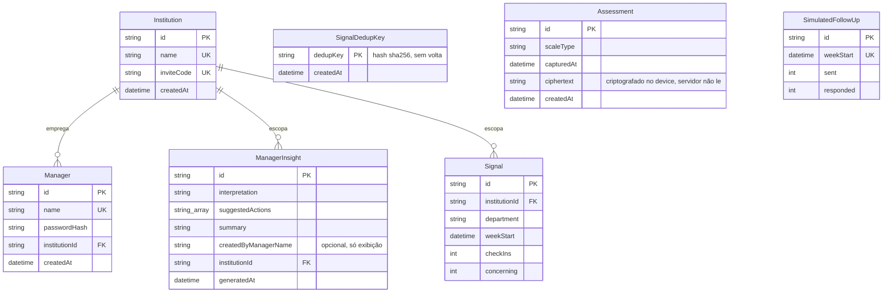
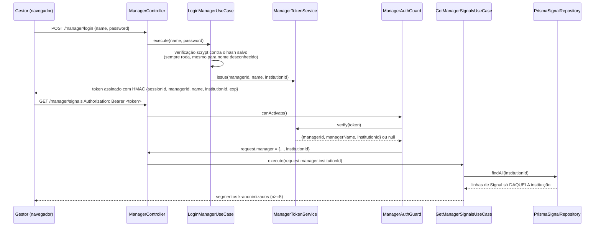
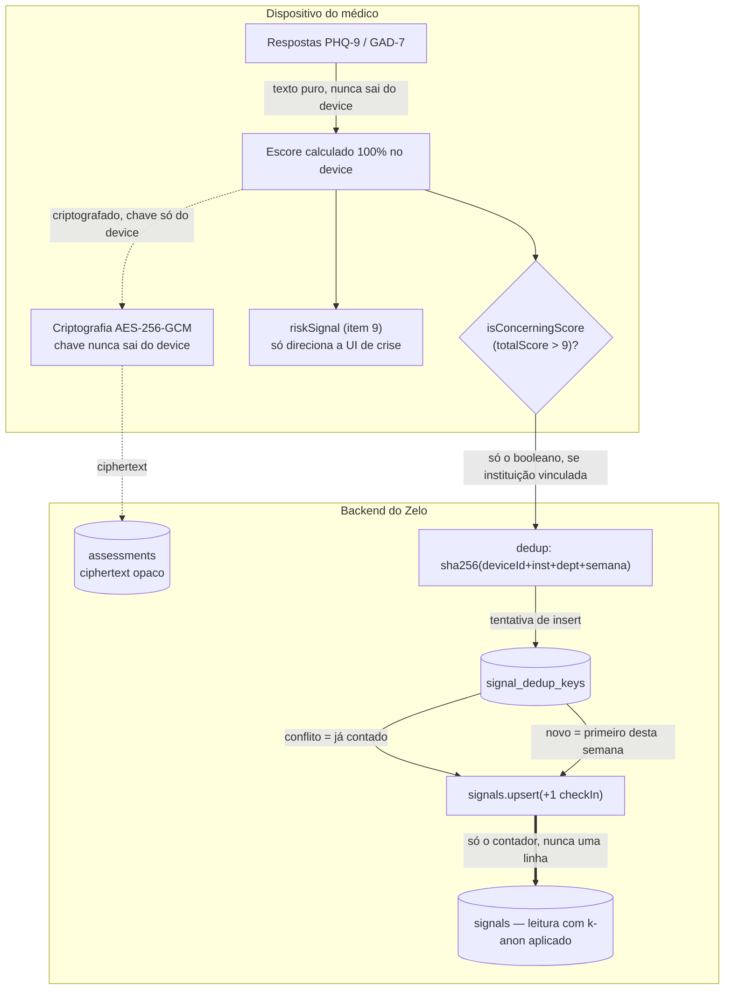

# Referência de Arquitetura

[🇺🇸 English](architecture-reference.md) · 🇧🇷 Português

**Última sincronização:** 2026-08-02, após o merge dos dois planos de implementação de
`2026-08-02-multi-institution-data-partitioning-design.md` na `main`.

Um PWA de bem-estar voltado ao médico e o painel do gestor hospitalar por trás dele, escrito para
quem for planejar o próximo trimestre deste sistema: o que existe hoje, por que tem esse formato,
onde vai esticar sem quebrar, e onde ainda não vai. Isto é uma fotografia, não uma visão ao vivo —
prefira sempre derivar do código a confiar neste documento depois que ele tiver avançado mais.

**Stack:** NestJS + Prisma + Postgres (backend) · React + Vite + TanStack Query (frontend) ·
monorepo pnpm + Turborepo · Fly.io (api) + GitHub Pages (web) + Neon (banco de dados).

---

## Sumário

**Fundamentos**
1. [Visão geral do sistema](#1-visão-geral-do-sistema)
2. [Princípios de arquitetura](#2-princípios-de-arquitetura)
3. [Modelo de dados](#3-modelo-de-dados)

**O sistema**
4. [Módulos do backend](#4-módulos-do-backend)
5. [Arquitetura do frontend](#5-arquitetura-do-frontend)
6. [Arquitetura de privacidade e anonimato](#6-arquitetura-de-privacidade-e-anonimato)
7. [Modelo multi-instituição](#7-modelo-multi-instituição)
8. [Modelo de segurança](#8-modelo-de-segurança)
9. [Deploy e CI/CD](#9-deploy-e-cicd)

**Planejando o futuro**
10. [Implementando uma nova funcionalidade](#10-implementando-uma-nova-funcionalidade)
11. [Escalabilidade](#11-escalabilidade)
12. [Trade-offs e dívida técnica](#12-trade-offs-e-dívida-técnica)
13. [Questões de design em aberto](#13-questões-de-design-em-aberto)

---

## 1. Visão geral do sistema

Zelo é um PWA mobile-first que oferece ao médico uma autoavaliação validada (PHQ-9, GAD-7 — o
MBI-HSS está desenhado mas não implementado, o texto dos itens é licenciado e ainda não foi
adquirido), um chat de acolhimento assistido por IA, e escalonamento de crise opcional. Hospitais
e cooperativas que financiam a ferramenta recebem um painel de gestor mostrando tendências de
burnout **anonimizadas e agregadas** entre a própria equipe — nunca a identidade de um indivíduo,
nem mesmo um indício dela.

Essa última frase é a arquitetura inteira resumida em uma linha. Toda decisão de design não-óbvia
neste código — a criptografia, o limiar de k-anonimidade, o fato de médicos nunca terem conta, o
esquema de hash de deduplicação no §6 — existe para tornar essa frase verdadeira sob escrutínio
adversarial, não só verdadeira no caminho feliz. Leia o resto deste documento como elaboração
dessa restrição, não como uma lista de decisões desconexas.

### Duas audiências, dois modelos de confiança

**Médicos — nunca fazem login.** O único portão é uma flag de consentimento local. Sem conta, sem
senha, sem sessão no servidor, nada que possa depois ligar uma pessoa aos seus check-ins. Isso é
uma promessa de produto, não uma funcionalidade faltando — ver §6.

**Gestores — um login real, aplicado pelo servidor.** Contas nomeadas, senhas com hash scrypt,
tokens de sessão assinados e vinculados a uma instituição. Aqui, manter quem não tem autorização
**de fora** é o ponto central — ver §7 e §8.

### Formato do repositório

| Caminho | O que mora ali |
|---|---|
| `apps/api` | Backend NestJS — Clean Architecture por módulo (§2, §4). |
| `apps/web` | PWA React + Vite — ports/use-cases/adapters também no frontend (§5). |
| `packages/domain` | Schemas Zod + entidades compartilhadas pelos dois apps (ex.: `Assessment`, `ChatMessage`). |
| `docker/` | Compose do Postgres local, Dockerfile da API para o Fly.io. |
| `docs/superpowers/` | Todo spec de design e plano de implementação com os quais este sistema foi de fato construído — a fonte primária do "por quê"; este documento é o "o quê". |

---

## 2. Princípios de arquitetura

### Clean Architecture, nos dois lados da conexão

Todo módulo do backend e toda funcionalidade não-trivial do frontend segue a mesma estrutura de
três camadas:

| Camada | Exemplo no backend | Exemplo no frontend |
|---|---|---|
| **Port** — uma interface + um token de DI, nada mais | `signal-checkin-repository.port.ts` | `signal-checkin.port.ts` |
| **Use-case** — a lógica de fato, testada contra um port falso | `record-signal-checkin.use-case.ts` | `record-signal-checkin.usecase.ts` |
| **Infrastructure** — o adapter concreto (Prisma, fetch, Web Crypto) | `prisma-signal-checkin.repository.ts` | `http-signal-checkin.adapter.ts` |

O retorno desse investimento aparece toda vez que o sistema é estendido: o teste de um use-case
nunca toca o Postgres ou a rede — ele é construído com um fake pequeno, em memória, implementando
o port, então a suíte inteira roda em segundos e nunca depende de infraestrutura estar de pé.
Quando você precisa de uma segunda implementação de qualquer coisa (um provedor de IA fake para
dev local, um adapter de chat fake para testes), é uma classe nova implementando um port
existente, não uma reescrita.

**Convenção de nomes, exatamente:**

- Backend: kebab-case, com sufixo de papel no nome do arquivo — `*.port.ts`, `*.use-case.ts`,
  `*.repository.ts`, `*.controller.ts`, `*.service.ts`, `*.guard.ts`. Tokens de DI são
  `Symbol("NOME_EM_SCREAMING_SNAKE")` exportados junto com a interface do port. Extensão `.ts`
  explícita em todo import (é um projeto ESM nativo).
- Frontend: mesma ideia, sufixos ligeiramente diferentes — `*.usecase.ts` (sem hífen antes de
  "case"), `*.port.ts`, `http-*.adapter.ts`, `*.store.ts` para stores Zustand. Sem extensão nos
  imports (resolvido pelo bundler).
- Sem DI de framework no frontend — `apps/web/src/app/container.ts` é um único arquivo de
  wiring manual, só `new X(new Y())`. Ele se lê como um grafo de dependências porque é um.

### Dois tipos de estado no frontend, escolhidos deliberadamente

**Zustand + `persist`** — flags locais ao dispositivo que precisam sobreviver a um reload:
consentimento, resposta de follow-up, sessão do gestor, vínculo com instituição. Lido fora do
React via `.getState()` em loaders de rota e hooks de orquestração — nunca re-derivado de uma
chamada de rede.

**TanStack Query** — qualquer coisa que toca a rede: logins, envios, as leituras do painel do
gestor. Um hook fino de `useMutation`/`useQuery` envolve exatamente uma chamada de use-case — os
hooks ficam burros, os use-cases continuam testáveis.

**O padrão que vale a pena copiar:** um use-case puro nunca acessa uma store diretamente (ver
`ShouldShowFollowUpPromptUseCase`, que recebe dado puro, não uma referência à store). É o *hook
ou componente que chama* que lê a store e passa valores simples para dentro. É isso que mantém
todo use-case testável sem precisar mockar o Zustand.

---

## 3. Modelo de dados

Sete tabelas. Duas delas (`Assessment`, `SignalDedupKey`) são construídas deliberadamente para
serem inúteis a um atacante mesmo com acesso total ao banco.

| Tabela | Para que serve | O que deliberadamente **não** tem |
|---|---|---|
| `institutions` | O limite do tenant. Uma linha por hospital/cooperativa. | Sem organograma, sem lista de departamentos — `department` é texto livre em todo lugar. |
| `managers` | Contas de login nomeadas, uma por instituição. | Sem campo de papel/permissão — todo gestor dentro de uma instituição é equivalente. |
| `manager_insights` | Análises geradas por IA sobre a tendência agregada, salvas. | `createdByManagerName` é uma string desnormalizada, não uma foreign key — nada neste schema usa `@relation` além do vínculo com a instituição. |
| `signals` | O agregado real: contagens de check-ins e de "preocupante" por instituição/departamento/semana. | **Nunca uma linha por pessoa.** Esta tabela só guarda contadores — ver §6. |
| `signal_dedup_keys` | Impede que um dispositivo infle sozinho a contagem do próprio departamento dentro de uma semana. | Nenhuma referência de volta a um dispositivo, instituição ou pessoa — só um hash de mão única (§6). |
| `assessments` | O histórico criptografado do próprio médico, só para o próprio dispositivo. | Sem `userId`. Sem escore em texto plano. Nenhum vínculo com `signals`. |
| `simulated_follow_ups` | KPI de taxa de resposta do follow-up de crise. | Ainda não tem escopo por instituição (`TD-003`, §12) — uma lacuna conhecida e aceita. |

Nota do gerador: `schema.prisma` usa o gerador `prisma-client` (não o client clássico), com saída
em `apps/api/generated/prisma`. A troca de adapter entre Neon e Postgres local (`PrismaNeon` com
driver WebSocket vs. `PrismaPg`) mora no construtor de `PrismaService`, decidida por
`DATABASE_URL` conter ou não `.neon.tech` — ver §9.

---

## 4. Módulos do backend

`apps/api/src/modules/` — seis módulos NestJS, cada um autocontido, ligados entre si só em
`app.module.ts`.

| Módulo | Responsável por | Autenticação |
|---|---|---|
| `health` | `GET /health` — o alvo do healthcheck do Fly.io. | Nenhuma |
| `chat` | Chat de acolhimento assistido por IA; provedor trocável (real vs. fake) via `AI_PROVIDER=mock`. | Nenhuma |
| `assessment` | `POST /assessments` — guarda o blob de ciphertext criptografado. Validado com Zod, rejeita um payload que carregue um array `answers` cru ou um campo `riskSignal` — reforçado na arquitetura, não só por convenção. | Nenhuma |
| `institution` | `GET /institutions/by-code/:code` — resolve um código de convite para `{ id, name }`. Nunca devolve `inviteCode`. | Nenhuma |
| `signal-checkin` | `POST /signals/checkin` — a escrita real, deduplicada e anônima do agregado (§6). | Nenhuma |
| `manager` | Login, tokens de sessão, leitura de sinais, geração de insight por IA, histórico de insights. O único módulo com autorização de verdade. | `ManagerAuthGuard`, em toda rota exceto o login |

### A cadeia de autenticação do módulo manager, traçada de ponta a ponta

Este é o único fluxo que vale a pena traçar com exatidão, porque é a costura onde um bug de
segurança real apareceria — e onde dois planos separados (escopo por instituição, depois o
pipeline real de sinal) precisaram encaixar sem enfraquecê-la.

`institutionId` nunca é lido de um corpo de requisição, de um query param, ou de qualquer lugar
controlável pelo cliente — ele só vem de um token com assinatura verificada. Toda chamada de
repositório com escopo de gestor recebe esse valor como parâmetro explícito e filtra
`WHERE institutionId = ...` no servidor. Não existe caminho de código onde um gestor consiga ver
as linhas de outra instituição, a não ser forjando uma assinatura HMAC.

---

## 5. Arquitetura do frontend

`apps/web/src/` — a mesma disciplina em camadas do backend, mais a camada de apresentação que o
React de fato exige.

| Pasta | Conteúdo |
|---|---|
| `domain/` | Funções puras sem dependência de framework — `isConcerningScore`, `bandFor`, definições das escalas de avaliação. |
| `ports/` | Interfaces + schemas Zod de resposta + classes de erro tipadas (ex.: `InstitutionNotFoundError`), um arquivo por fronteira externa. |
| `use-cases/` | Classes de orquestração, injetadas via construtor com ports, testadas unitariamente contra fakes. |
| `infrastructure/` | Adapters concretos: `http-*.adapter.ts` (fetch), `web-crypto-encryption.adapter.ts`, `indexeddb-assessment-store.adapter.ts`. |
| `stores/` | Stores Zustand + `persist` — ver §2. |
| `presentation/` | `pages/`, `hooks/` (wrappers finos de TanStack Query), `layout/` (`PhoneShell`, `Sidebar`, `BottomNav`), `ui/` (primitivos: `Card`, `Button`, `IconBadge`). |
| `app/` | `router.tsx` (tabela de rotas + loaders), `container.ts` (wiring de DI), CSS global. |

### Rotas e guardas

O data router do `react-router` (`createBrowserRouter`), um único array plano `routeChildren` em
`router.tsx` que tanto o app quanto `router.test.tsx` importam diretamente — a suíte de testes
nunca pode se distanciar silenciosamente do que de fato vai para produção. Dois padrões de guarda
independentes, espelhando os dois modelos de confiança do §1:

- **Protegido por consentimento** (`/home`, `/you`, `/you/link`, ...): o loader redireciona para
  `/privacy` se `!useConsentStore.getState().hasConsented`.
- **Protegido por sessão** (`/manager`, `/manager/history`): o loader redireciona para
  `/manager/login` se `!useManagerSessionStore.getState().isValid()` — é só conveniência de UX;
  o limite real é o `ManagerAuthGuard` no servidor (§4).

### `PhoneShell`: um componente, três classes de dispositivo

Toda tela é renderizada dentro de `PhoneShell`, que recebe duas props booleanas independentes:
`nav` (barra lateral persistente `Sidebar` a partir de 768px, só nas quatro telas de destino
principais — Home, Chat, Peers, Você) e `centered` (limita a largura do corpo a uma coluna
legível a partir de 768px, usado por toda tela autônoma/de fluxo focado — login, consentimento,
crise, o fluxo de vínculo com instituição). As duas se combinam de forma independente; a maioria
das telas precisa só de uma.

---

## 6. Arquitetura de privacidade e anonimato

A promessa central de confiança do produto — "ninguém do hospital vê quem você é" — traçada até
quais bytes cruzam qual fronteira, em que forma.

### Dois sinais deliberadamente separados — nunca confundir

| | `riskSignal` | `isConcerningScore` |
|---|---|---|
| Origem | Só o item 9 do PHQ-9 (ideação de autolesão) | `totalScore > 9`, em qualquer escala |
| Propósito | Oferecer o fluxo de escalonamento de crise, localmente | Alimentar o sinal agregado anônimo |
| É transmitido? | **Nunca** — o controller de assessment descarta o campo silenciosamente | Sim, como um booleano isolado, só se o dispositivo estiver vinculado |
| Cobertura de escala | Só PHQ-9 | PHQ-9 e GAD-7 (o teto da banda "Leve" é 9 nas duas) |

### O que "nunca uma linha por pessoa" realmente significa

O endpoint de check-in (§4, §7) não grava uma linha para agregar depois — não existe uma tabela
intermediária que uma invasão ou alguém de dentro possa ler para reconstruir quem enviou o quê.
As únicas duas escritas são:

1. Uma tentativa de inserir um hash de mão única em `signal_dedup_keys` — a linha, se for
   gravada, é indistinguível de qualquer outro hash; nada nela diz de qual instituição,
   departamento ou dispositivo ela veio.
2. Um `UPSERT` atômico nos contadores de `signals` — o único artefato que persiste é "N
   check-ins, M preocupantes, esta instituição, este departamento, esta semana."

Como o hash de deduplicação inclui `weekStart`, o hash do mesmo dispositivo muda toda semana —
`signal_dedup_keys` não pode ser usado para construir um perfil longitudinal de um dispositivo
mesmo que todas as linhas nela fossem expostas.

**A k-anonimidade é aplicada no momento da leitura, no servidor, sempre.**
`K_ANONYMITY_THRESHOLD = 5` (`manager/application/constants.ts`). `GetManagerSignalsUseCase`
descarta qualquer segmento de `institutionId + department` abaixo desse número *antes* de
serializar a resposta — o cliente nunca recebe um segmento abaixo do limiar para filtrar do lado
dele. Isso importa: um filtro no cliente exigiria que o servidor tivesse enviado o segmento
pequeno pela rede primeiro.

---

## 7. Modelo multi-instituição

Como "de qual hospital são esses números anônimos" é respondido sem nunca criar uma identidade.

### O fluxo de vínculo, de ponta a ponta

1. Um hospital distribui um código de convite fora do app (integração de RH, um memorando
   interno).
2. O médico abre **Você → Vincular a um hospital** (ou um banner na Home mostrado só enquanto
   não vinculado) e digita o código.
3. `GET /institutions/by-code/:code` resolve o código — sem autenticação, é só resolução de
   código para id, o mesmo nível de confiança do antigo código de acesso compartilhado do
   gestor, ao qual esse mecanismo é filosoficamente parecido.
4. O médico digita um departamento em texto livre, uma única vez.
5. O dispositivo gera um `deviceSignalId` aleatório e guarda
   `{ institutionId, institutionName, department, deviceSignalId }` em `localStorage` — nunca
   enviado a lugar nenhum como identidade, usado só localmente para montar o hash de
   deduplicação do §6.

**Esta é uma fronteira de confiança deliberadamente frouxa.** O código de convite prova "entrou
pela porta certa", não vínculo empregatício. Não há verificação de que a pessoa que está
vinculando de fato trabalha naquela instituição — o mesmo modelo de confiança que o antigo código
de acesso compartilhado do gestor já tinha. Departamento em texto livre significa nenhum
organograma para manter, mas também nenhuma proteção contra erros de digitação fragmentando a
contagem de um departamento (mitigado por remover espaços nas pontas do texto, não eliminado).

### Para que "opcional" é indispensável

Um médico que nunca vincula nada não perde *nada*, exceto não entrar na contagem do agregado de
nenhum hospital — a autoavaliação e o chat são idênticos de qualquer forma. Isso não é uma
conveniência; é a mesma promessa de anonimato do §1, estendida a um médico que, por qualquer
motivo, não quer que o próprio hospital saiba sequer que ele usa o app.

### Onde o limite do tenant é de fato aplicado

| Camada | Aplicação |
|---|---|
| Schema | `Manager.institutionId`, `ManagerInsight.institutionId`, `Signal.institutionId` são todos FKs obrigatórios, não anuláveis. |
| Token de sessão | Assinado com HMAC, carrega `institutionId` — não pode ser forjado ou editado no cliente. |
| Toda query com escopo de gestor | Recebe `institutionId` como parâmetro explícito; nenhuma query roda sem escopo. |
| Chave de agrupamento da k-anonimidade | `institutionId + department`, não só `department` — duas instituições não conseguem juntar departamentos pequenos para fingir alcançar n=5 em nenhuma das duas. |

---

## 8. Modelo de segurança

O que é autenticado, o que deliberadamente não é, e por que cada escolha é defensável, não um
acidente.

### Autenticação do gestor

- **Senhas:** `scrypt` do `node:crypto` + salt, comparado com `timingSafeEqual` — sem
  dependência de bcrypt/argon2, seguindo a mesma convenção de "nenhuma biblioteca de cripto
  nova" do resto deste módulo.
- **Simetria na divulgação de erro:** um nome desconhecido e uma senha errada lançam exatamente
  o mesmo `InvalidManagerCredentialsError` → 401, e o use-case de login sempre roda uma
  verificação scrypt de verdade (contra um hash fictício para nomes desconhecidos), para que o
  tempo de resposta não revele se um nome tem conta ou não.
- **Tokens de sessão:** um token opaco assinado com HMAC-SHA256 feito à mão (não uma biblioteca
  JWT), payload em JSON, expiração de 8 horas, guardado em `sessionStorage` (não
  `localStorage` — morre com a aba, deliberadamente).

**TD-001 — sessionStorage + Bearer, não um cookie HttpOnly.** Aceito, não corrigido: o frontend
(GitHub Pages) e a API (Fly.io) são cross-origin, então um cookie HttpOnly precisaria de
`SameSite=None`, o que remove a proteção contra CSRF que os cookies deveriam dar, a não ser que
um token CSRF seja adicionado também — uma migração de ~3–5 horas, não uma troca rápida. Controle
compensatório: nenhum `dangerouslySetInnerHTML` em nenhuma rota do gestor, o que fecha o vetor de
XSS que de fato importaria dado esse desenho.

### Endpoints deliberadamente sem autenticação

Cinco endpoints não exigem autenticação nenhuma: `POST /assessments`, `POST /chat/*`,
`GET /institutions/by-code/:code`, `POST /signals/checkin`, e o próprio `login` do gestor. Para
os dois primeiros, esse é o ponto central — um médico nunca prova identidade a este app. Para os
endpoints de instituição e check-in, isso decorre do §7: vincular não é um login, então não há
nada para autenticar ainda naquele ponto do fluxo.

**Lacuna conhecida — ainda sem rate limit por endpoint.** Só um `ThrottlerModule` global (100
requisições/60s por IP, via `APP_GUARD` em `app.module.ts`) protege toda rota de forma uniforme.
Os dois endpoints públicos e sem autenticação acima não têm limite *mais apertado* próprio, mesmo
um dispositivo real fazendo check-in no máximo uma vez por semana. Um código de convite de baixa
entropia e adivinhável (os semeados se parecem com `hospital-2026`) somado a um `deviceSignalId`
rotativo poderia inflar os contadores de um departamento bem além do que o throttle pega.
Sinalizado, ainda não corrigido — ver §12.

### Transporte e infraestrutura

- `force_https = true` no `fly.toml` — nada chega à API por HTTP em texto plano em produção.
- Os adapters de driver do Prisma são escolhidos por ambiente (`PrismaNeon` sobre WebSocket para
  o banco de produção hospedado no Neon, `PrismaPg` para o Postgres local no Docker) — ver o
  construtor de `PrismaService`.
- O Zod valida todo corpo de requisição na fronteira do controller; `BadRequestException` do
  NestJS é o formato uniforme de resposta 400.

---

## 9. Deploy e CI/CD

Dois apps, dois pipelines, dois hosts — separados deliberadamente para que a mudança de um app
não dispare o deploy do outro.

| | `apps/api` | `apps/web` |
|---|---|---|
| Host | Fly.io, região `gru` (São Paulo) | GitHub Pages |
| Build | `docker/api.Dockerfile` | Vite, base path vindo da saída do `configure-pages` |
| Workflow de CI | `.github/workflows/api.yml` | `.github/workflows/web.yml` |
| Banco de dados | Postgres no Neon (produção) / Postgres via Docker Compose (dev local + CI) | *(o mesmo)* |

**Migrações e seed são sempre manuais.** Nem `prisma migrate deploy` nem o script de seed rodam
automaticamente no deploy. Depois de qualquer mudança de schema ir para produção, os dois
precisam ser rodados manualmente, na ordem certa — pular qualquer um dos dois quebra o login do
gestor (ou, pior, deixa tabelas faltando silenciosamente) em produção, não na CI. Ver
`apps/api/prisma/README.md`.

**O script de seed agora pode apagar dados reais.** Antes do vínculo com instituições existir,
rodar o seed de novo só afetava linhas fabricadas de demonstração. Agora que médicos reais podem
se vincular às mesmas instituições semeadas (`zelo-demo-2026`, `sao-lucas-2026`), rodar o seed de
novo contra um ambiente onde um dispositivo real já se vinculou apaga os check-ins reais dele —
documentado como um aviso explícito em `apps/api/prisma/README.md`, mas ainda não prevenido no
código. Trate qualquer instituição piloto como uma que **não** deve ser uma instituição de
demonstração semeada.

---

## 10. Implementando uma nova funcionalidade

A receita que este código já seguiu uma dúzia de vezes — siga-a e uma funcionalidade nova cai de
graça na engrenagem existente de teste/revisão/deploy.

### Adicionando um novo endpoint no backend

1. Módulo novo em `apps/api/src/modules/<nome>/`, espelhando `assessment/` (um único endpoint
   público) ou `manager/` (protegido, múltiplos endpoints), dependendo do formato.
2. Port + token de DI primeiro (`application/ports/*.port.ts`), depois um use-case
   (`application/use-cases/*.use-case.ts`) com um teste falhando contra uma implementação falsa
   do port.
3. Schema Zod no controller para validar a requisição — não `class-validator`, não um pacote
   compartilhado a não ser que o formato seja uma entidade de domínio genuinamente cross-app
   (compare `AssessmentSchema` em `@zelo/domain` com o schema de login do gestor, que é local ao
   próprio controller).
4. Repositório Prisma implementando o port, conectado em `*.module.ts`, depois registrado no
   array `imports` de `app.module.ts`.
5. Mudanças de schema: `prisma migrate dev --create-only`, inspecione o SQL gerado, depois
   aplique. Se a tabela já tem linhas em produção e ganha uma coluna obrigatória, edite a
   migração à mão na ordem anulável → preenchimento retroativo → `NOT NULL` → constraint — o
   Prisma não gera isso com segurança sozinho.

### Adicionando um novo fluxo no frontend

1. Port + schema Zod de resposta + classe de erro tipada em `ports/`.
2. `Http*Adapter` em `infrastructure/http/`, use-case em `use-cases/`, os dois testados
   unitariamente (o adapter geralmente não é — passthroughs finos seguem a mesma convenção de
   "não testado" dos repositórios Prisma do backend).
3. Conecte os dois em `container.ts`.
4. Um hook fino `useX` em `presentation/hooks/` envolvendo `useMutation`/`useQuery` ao redor do
   use-case.
5. Componente de página em `presentation/pages/`, construído a partir dos primitivos existentes
   `PhoneShell`/`Card`/`Button` — verifique uma página de fluxo autônomo já existente
   (`ManagerLoginPage`) ou de destino (`HomePage`) para a convenção mais parecida antes de
   inventar uma nova.
6. Entrada de rota em `routeChildren` de `router.tsx`, constante de caminho em `routes.ts`,
   loader de guarda seguindo o modelo de confiança que se aplica (§5).

**Antes de escrever código:** confira `docs/superpowers/specs/`. Quase todo módulo deste sistema
tem um spec de design correspondente (o "por quê") e um plano de implementação (o "como" exato,
tarefa por tarefa, com o código de fato que foi entregue). Para qualquer funcionalidade
não-trivial, o caminho mais rápido para bater com as convenções deste código exatamente é achar o
spec já entregue mais parecido e espelhar o formato dele.

---

## 11. Escalabilidade

O que aguenta o volume de hoje, e o ponto exato onde cada parte precisaria mudar primeiro
conforme o uso cresce. Nada disto está construído ainda — é a superfície de planejamento para a
qual este documento existe.

### Pontos de pressão no curto prazo

| Componente | Hoje | Primeira coisa a mudar |
|---|---|---|
| Computação da API | Uma única máquina no Fly.io, região `gru`, `min_machines_running = 1` | Sem autoscaling configurado — adicionar limites de quantidade de máquinas/concorrência antes de tráfego real multi-hospital, não depois. |
| Escritas em `signals` | Upsert síncrono por check-in, uma linha por instituição/departamento/semana | Contenção na mesma linha durante picos de troca de turno em um hospital grande — uma fila de escrita em lote agrupando incrementos removeria isso, mas não é necessária no volume atual. |
| Leituras do painel do gestor | `GetManagerSignalsUseCase` reagrega a partir de `signals` a cada requisição | Ainda sem camada de cache. Tudo bem enquanto a tabela é pequena; vale uma view materializada ou cache de TTL curto quando o volume de check-ins crescer. |
| Onboarding de instituição | Só entradas manuais no script de seed, sem self-service | Vira um gargalo operacional antes de virar um problema de segurança — uma ferramenta interna pequena (ainda não self-service para o hospital) é o próximo passo natural, bem antes de um cadastro público. |
| Limiar de k-anonimidade | Uma única constante global (`K_ANONYMITY_THRESHOLD = 5`) | Limiares por instituição permitiriam que um hospital muito grande revelasse granularidade de departamento mais fina com segurança — não necessário enquanto toda instituição real é pequena. |

### O que não precisa mudar tão cedo

- A camada de Clean Architecture (§2) escala adicionando módulos, não reestruturando os
  existentes — toda funcionalidade entregue até agora foi aditiva no nível de módulo.
- O modelo de privacidade local ao dispositivo (§6) não tem custo de escala no servidor por
  construção: não há dado por pessoa para crescer.
- Separar a CI por app (§9) já evita que uma mudança não relacionada no backend rode de novo a
  suíte (mais lenta) do frontend, e vice-versa.

---

## 12. Trade-offs e dívida técnica

Cada item aqui foi uma decisão deliberada e documentada — não um descuido. O registro completo
mora em `docs/superpowers/specs/technical-debt.md`; este é o resumo que um arquiteto precisa sem
ler o histórico de cada item.

| ID | Decisão | Status |
|---|---|---|
| `TD-001` | Sessão do gestor em `sessionStorage` + header Bearer, não um cookie HttpOnly (§8). | Aceito, adiado |
| `TD-002` | Histórico de insights era compartilhado entre todos os gestores de uma instituição. | Resolvido — agora filtrado por `institutionId`. |
| `TD-003` | O KPI de taxa de resposta do follow-up (`SimulatedFollowUp`) não tem `institutionId` — toda instituição hoje compartilha um único número. | Aceito, adiado — seguro hoje porque o dado é fabricado para demonstração; revisitar quando os follow-ups virarem reais. |
| — | Sem rate limit por endpoint nos dois endpoints públicos sem autenticação (§8). | Registrado, pendente |
| — | O script de seed pode apagar check-ins reais se rodado de novo contra uma instituição vinculada (§9). | Documentado, ainda não prevenido no código. |
| — | Desvincular e vincular de novo na mesma semana conta em dobro (um `deviceSignalId` novo é gerado a cada vínculo). | Trade-off aceito — a alternativa (manter o id entre desvínculos) enfraquece a promessa de "desvincular não deixa rastro". |
| — | `deviceSignalId` trafega em texto plano em cada check-in. | Mitigado pelo transporte só-HTTPS; a garantia em repouso (§6) continua valendo de qualquer forma. |

---

## 13. Questões de design em aberto

Trabalho de design real, com escopo definido, esperando uma decisão de produto — não ideias
vagas.

- **Identidade do lado do médico, para pareamento real entre pares.** O modelo `User` completo +
  autenticação por magic-link de `identity-and-aggregation.md` foi desenhado mas nunca
  construído — `PeersPage` ainda roda sobre um placeholder. Três specs mais estreitos já
  entregaram partes reais do problema ao redor (modelo de instituição, contas de gestor, o
  pipeline de sinal) sem precisar dele, mas o pareamento real entre pares ainda precisa de algum
  conceito de identidade do médico.
- **Canal de WhatsApp.** Totalmente desenhado (`2026-07-28-whatsapp-channel-design.md`) com um
  fluxo de vínculo de dispositivo via OTP já planejado para espelhar o mesmo padrão local ao
  dispositivo, sem login, deste sistema — mas vive em uma branch não mesclada, ainda fora da
  `main`, na data deste documento.
- **Normalização de departamento.** Ainda é texto livre (§7) — uma lista fixa de organograma é
  um não-objetivo explícito até que os dados de alguma instituição de fato precisem disso.
- **Onboarding self-service de instituição.** Explicitamente fora de escopo; a seção de
  escalabilidade (§11) já nomeia o passo menor e mais próximo (uma ferramenta interna, não um
  cadastro público) que vale a pena construir primeiro.
